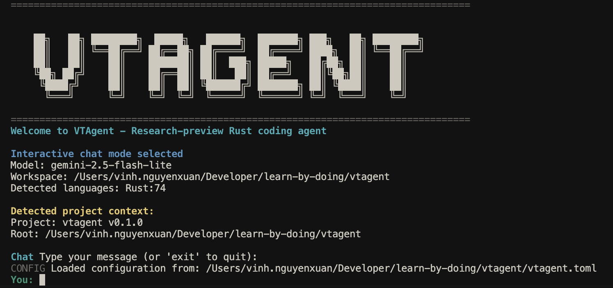

# VTAgent - minimal coding agent

[](https://github.com/vinhnx/vtagent/actions/workflows/tool-eval.yml)

VTAgent is a Rust-based terminal coding agent with modular architecture supporting multiple LLM providers (Gemini, OpenAI, Anthropic) and tree-sitter parsers for 6+ languages. It provides a reliable, context-aware coding experience through intelligent tool integration and sophisticated prompt engineering.

<div align="center">
  
</div>

## Features

### Core Capabilities

- **Multi-Agent Architecture**: Orchestrator, Explorer, and Coder agents for specialized tasks
- **Multiple LLM Providers**: Gemini, OpenAI, Anthropic support
- **Advanced Code Analysis**: Tree-sitter parsers for Rust, Python, JavaScript, TypeScript, Go, Java
- **Intelligent Tool Suite**: File operations, search, terminal commands, and PTY integration
- **Configuration Management**: TOML-based configuration with comprehensive policies
- **Safety & Security**: Path validation, command policies, and human-in-the-loop controls

### Key Features

- **Context Engineering**: Full conversation history with intelligent management
- **Workspace Safety**: Path validation and configurable file exclusions
- **Enhanced PTY Support**: Full terminal emulation for interactive commands
- **Batch Operations**: Efficient multi-file processing and terminal command execution
- **Configuration Flexibility**: Comprehensive TOML configuration for all aspects
- **Multi-Agent Coordination**: Strategic task delegation and verification workflows

## Quick Start

### Prerequisites

- Rust 1.75+ (stable)
- API key for your preferred LLM provider:
  - `GEMINI_API_KEY` or `GOOGLE_API_KEY` for Gemini
  - `OPENAI_API_KEY` for OpenAI
  - `ANTHROPIC_API_KEY` for Anthropic

### Installation

```bash
# Clone the repository
git clone https://github.com/vinhnx/vtagent.git
cd vtagent

# Build the project
cargo build --release

# Or use the provided scripts
./run.sh              # Production build + run
./run-debug.sh        # Development build + run
```

### Basic Usage

```bash
# Set your API key
export GEMINI_API_KEY=your_api_key_here

# Initialize VTAgent in your project
./run.sh init  # Creates vtagent.toml and .vtagentgitignore

# Start interactive chat
./run.sh chat

# Or run specific commands
cargo run -- chat
```

## Architecture

### Core Components

- **`vtagent-core/`**: Library crate with core functionality
- **`src/`**: Binary crate with CLI interface
- **`prompts/`**: System prompts for different agent types
- **`docs/`**: Comprehensive documentation
- **Tool specs**: see `docs/tools/TOOL_SPECS.md` for schemas, examples, and limits
- **`examples/`**: Usage examples and demonstrations

### Agent Types

#### Orchestrator Agent
- **Strategic coordinator** managing complex development tasks
- **Task delegation** to specialized subagents
- **Context management** and knowledge accumulation
- **Verification workflows** ensuring implementation quality

#### Explorer Agent
- **Read-only investigator** for understanding and verification
- **System exploration** and configuration discovery
- **Implementation verification** of coder agent work
- **Structured reporting** through context accumulation

#### Coder Agent
- **Implementation specialist** with full write access
- **Code generation** and modification capabilities
- **Technical sophistication** in debugging and optimization
- **Quality assurance** through comprehensive testing

## Configuration

VTAgent uses a comprehensive TOML configuration system loaded from `vtagent.toml`:

### Basic Configuration

```toml
# Agent behavior settings
[agent]
model = "gemini-2.5-flash-lite"
max_conversation_turns = 1000
verbose_logging = false

# Security and safety settings
[security]
human_in_the_loop = true
confirm_destructive_actions = true
max_file_size_mb = 50

# Tool execution policies
[tools]
default_policy = "prompt"

[tools.policies]
read_file = "allow"
write_file = "prompt"
run_terminal_cmd = "prompt"

# Command permissions
[commands]
allow_list = ["ls", "pwd", "cat", "git status", "cargo check"]
deny_list = ["rm -rf", "sudo rm", "shutdown"]

# PTY configuration
[pty]
enabled = true
default_rows = 24
default_cols = 80
command_timeout_seconds = 300
```

### Configuration Commands

```bash
# Initialize with default configuration
./run.sh init

# Generate complete configuration (preserves existing settings)
./run.sh config

# Generate configuration and save to specific file
./run.sh config --output my-config.toml

# Copy example configuration
cp vtagent.toml.example vtagent.toml

# Validate configuration
./run.sh config --validate
```

**Configuration Generation**: The `config` command implements two-way synchronization:
- **Reads existing `vtagent.toml`** if present, preserving your customizations
- **Generates complete TOML** with all sections, even missing ones
- **Falls back to defaults** if no configuration exists
- **Ensures consistency** between your config file and generated templates

## Tool Suite

### File Operations
- `list_files(path?)` - Explore directories with metadata
- `read_file(path, start_line?, end_line?)` - Read text files with line control
- `write_file(path, content)` - Create or overwrite files
- `edit_file(path, old_string, new_string)` - Surgical file editing

### Search & Analysis
- `rp_search(pattern, path?)` - Fast text search using ripgrep
- `grep_search(pattern, include_pattern?)` - Advanced regex search
- `ast_grep_search(pattern, language?)` - Syntax-aware code search

### Terminal Integration
- `run_terminal_cmd(command)` - Execute terminal commands
- `run_in_terminal(command, is_background?)` - Enhanced terminal execution

### PTY Support
- `configure_notebook(file_path)` - Configure Jupyter notebook kernels
- `run_notebook_cell(cell_id, file_path)` - Execute notebook cells
- `read_notebook_cell_output(cell_id, file_path)` - Read cell execution results

### Color Utilities
VTAgent now includes advanced color manipulation capabilities through the `coolor` crate integration:

- RGB to ANSI color conversion for terminal compatibility
- HSL color space support for intuitive color manipulation
- Color blending and harmonious color scheme generation
- Lighten/darken operations for dynamic color adjustments

These utilities are available through the `vtagent_core::utils::colors` module for developers extending VTAgent's functionality.

## Usage Examples

### Basic Chat Session

```bash
# Start interactive chat with tools
./run.sh chat

# Single question mode (no tools)
./run.sh ask "Explain Rust ownership"

# Verbose chat with detailed logging
./run.sh chat-verbose
```

### Project Analysis

```bash
# Analyze current project structure
./run.sh analyze

# Display performance metrics
./run.sh performance
```

### Project Creation

```bash
# Create new Rust project with features
./run.sh create-project my-api serde,axum,tokio

# Available features: web frameworks, databases, async runtimes, etc.
```

### Context Management

```bash
# Compress conversation context for long sessions
./run.sh compress-context

# Demo async file operations
./run.sh demo-async
```

### Snapshot Management

```bash
# List all available snapshots
./run.sh snapshots

# Revert to previous turn
./run.sh revert --turn 5

# Clean up old snapshots (keep last 20)
./run.sh cleanup-snapshots --max 20
```

### Configuration Management

```bash
# Initialize project with configuration
./run.sh init

# Manage tool policies
./run.sh tool-policy status
./run.sh tool-policy allow read_file
./run.sh tool-policy deny run_terminal_cmd

# Manage models and providers
./run.sh models list
./run.sh models set-provider openai
./run.sh models set-model gpt-5
./run.sh models test gemini
```

## Command Reference

### Core Commands

- **`chat`** - Interactive AI coding assistant with full tool access
- **`ask <prompt>`** - Single question mode without tool usage
- **`chat-verbose`** - Interactive chat with enhanced logging and transparency
- **`analyze`** - Comprehensive workspace analysis and project overview
- **`performance`** - Display system performance metrics and statistics

### Project Management

- **`init`** - Initialize project with VTAgent configuration and AGENTS.md
- **`create-project <name> <features>`** - Generate complete Rust project with specified features

### Advanced Features

- **`compress-context`** - Compress conversation context for long-running sessions
- **`demo-async`** - Demonstrate async file operations and diff rendering

### Snapshot System

- **`snapshots`** - List all available conversation snapshots
- **`revert --turn <n> [--partial <scope>]`** - Revert to previous conversation state
- **`cleanup-snapshots [--max <n>]`** - Clean up old snapshots (default: keep 50)

### Configuration

- **`tool-policy <command>`** - Manage tool execution policies
  - `status` - Show current policies
  - `allow <tool>` - Allow specific tool
  - `deny <tool>` - Deny specific tool
  - `reset` - Reset to defaults

- **`models <command>`** - Manage LLM providers and models
  - `list` - Show available providers and models
  - `set-provider <provider>` - Switch LLM provider
  - `set-model <model>` - Set specific model
  - `test <provider>` - Test provider connectivity
