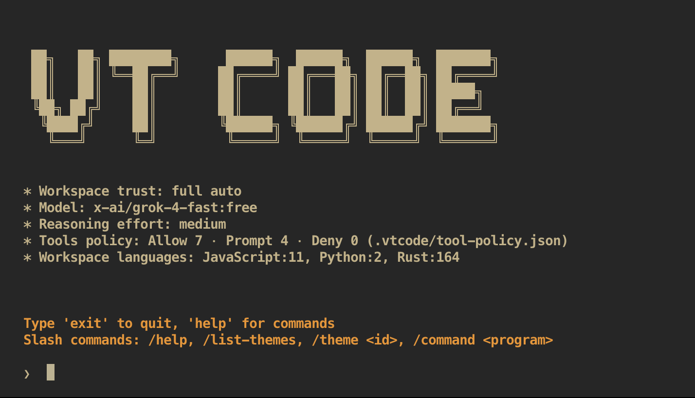

<div align="center">

<h1>VT Code</h1>

<p align="center">
  <a href="https://crates.io/crates/vtcode">
    
  </a>
  <a href="https://docs.rs/vtcode">
    
  </a>
</p>

<p align="center"><code>cargo install vtcode</code><br />or <code>brew install vinhnx/tap/vtcode</code><br />or <code>npm install -g @vinhnx/vtcode</code></p>

<p align="center"><strong>VT Code</strong> is a Rust-based terminal coding agent with semantic code understanding and an enhanced TUI experience.
</br>
</br>Built for developers who demand precision, security, and efficiency in their coding workflows.</p>

<p align="center">
  
</p>

</div>

---

## Quickstart

### Installing and running VT Code

Install globally with Cargo:

```shell
cargo install vtcode
```

Alternatively, with Homebrew:

```shell
brew install vinhnx/tap/vtcode
```

Or with npm:

```shell
npm install -g @vinhnx/vtcode
```

Then simply run `vtcode` to get started:

```shell
vtcode
```

<details>
<summary>You can also download pre-built binaries from <a href="https://github.com/vinhnx/vtcode/releases/latest">GitHub Releases</a>.</summary>

Available for:

-   **macOS**: Apple Silicon (`aarch64-apple-darwin`) and Intel (`x86_64-apple-darwin`)
-   **Linux**: x86_64 and ARM64 architectures
-   **Windows**: x86_64 architecture

Each archive contains the executable - extract and rename to `vtcode` if needed.

</details>

### Configuration

Set your API key for your preferred provider:

```shell
export OPENAI_API_KEY="your_key_here"
# or
export ANTHROPIC_API_KEY="your_key_here"
# or
export XAI_API_KEY="your_key_here"
# or
export GEMINI_API_KEY="your_key_here"
# or
export OPENROUTER_API_KEY="your_key_here"
```

Alternatively, create a `.env` file in your project directory:

```shell
# .env file
OPENAI_API_KEY=your_openai_key_here
ANTHROPIC_API_KEY=your_anthropic_key_here
XAI_API_KEY=your_anthropic_key_here
GEMINI_API_KEY=your_gemini_key_here
OPENROUTER_API_KEY=your_openrouter_key_here
```

**Automatic API Key Inference**: VTCode automatically uses the correct environment variable based on your provider setting in `vtcode.toml`:

-   `provider = "openai"` → `OPENAI_API_KEY`
-   `provider = "anthropic"` → `ANTHROPIC_API_KEY`
-   `provider = "gemini"` → `GEMINI_API_KEY`
-   `provider = "xai"` → `XAI_API_KEY`
-   `provider = "deepseek"` → `DEEPSEEK_API_KEY`
-   `provider = "openrouter"` → `OPENROUTER_API_KEY`

VT Code supports advanced configuration via `vtcode.toml`. See [Configuration](docs/project/) for details.

### Using OpenRouter models

OpenRouter support unlocks any hosted model by ID, including the latest Grok and Qwen3 coding releases.

```shell
vtcode --provider openrouter --model x-ai/grok-code-fast-1 chat
```

Or persist the configuration in `vtcode.toml`:

```toml
[agent]
provider = "openrouter"
default_model = "qwen/qwen3-coder"
```

Custom model IDs are accepted as long as they match your OpenRouter account access. Streaming and tool-calling work out of the box
using the OpenAI-compatible Responses API.

---

## Enhanced Terminal Interface

VT Code now features a completely revamped terminal user interface with numerous enhancements:

### Visual Improvements
- Modern, clean interface with rounded borders and improved styling
- Customizable color themes with Catppuccin integration
- Enhanced message formatting with distinct markers for different message types
- Real-time command output display with proper ANSI color support

### Interaction Features
- Full mouse support for scrolling and text selection
- Interactive text selection with click-and-drag functionality
- Improved input area with placeholder text ("Implement {feature}...")
- Slash command auto-suggestions for quick access to built-in commands

### Terminal Command Support
- Real-time PTY (pseudo-terminal) integration for running shell commands
- Dedicated terminal output panels with command summaries
- Streaming output display for long-running processes
- Proper handling of ANSI escape sequences and colors

### Navigation & Controls
- Smooth scrolling with mouse wheel and keyboard shortcuts
- Page navigation with Page Up/Down keys
- Dedicated status bar with contextual information
- Clear exit and cancel controls (Esc key)

---

## Core Features

**Multi-Provider AI Support**

-   Gemini, OpenAI, Anthropic, xAI, OpenRouter, and DeepSeek integration
-   Automatic provider selection and failover
-   Cost optimization with safety controls

**Enhanced Terminal User Interface**

-   Modern TUI with mouse support and text selection
-   Real-time terminal command output with ANSI color support
-   Customizable themes with Catppuccin color palette integration
-   Interactive slash commands with auto-suggestions
-   Smooth scrolling and navigation controls

**Advanced Code Intelligence**

-   Tree-sitter parsing for 6+ languages (Rust, Python, JavaScript, TypeScript, Go, Java)
-   Semantic code analysis and pattern recognition
-   Intelligent refactoring and optimization suggestions
-   Git-aware fuzzy file search backed by the `ignore` and `nucleo-matcher` crates

**Enterprise Security**

-   Workspace boundary enforcement
-   Configurable command allowlists
-   Human-in-the-loop controls for safety
-   Comprehensive audit logging

**Modular Architecture**

-   Trait-based tool system for extensibility
-   Multi-mode execution (terminal, PTY, streaming)
-   Intelligent caching and performance optimization
-   Plugin architecture for custom tools

---

## Documentation

-   [**Getting Started**](docs/user-guide/getting-started.md) - Installation and basic usage
-   [**Configuration**](docs/project/) - Advanced configuration options
-   [**Architecture**](docs/ARCHITECTURE.md) - Technical architecture details
-   [**Advanced Features**](docs/ADVANCED_FEATURES_IMPLEMENTATION.md) - Safety controls and debug mode
-   [**API Reference**](https://docs.rs/vtcode) - Complete API documentation
-   [**Contributing**](CONTRIBUTING.md) - Development guidelines

---

## License

This project is licensed under the MIT License - see [LICENSE](LICENSE) for details.
