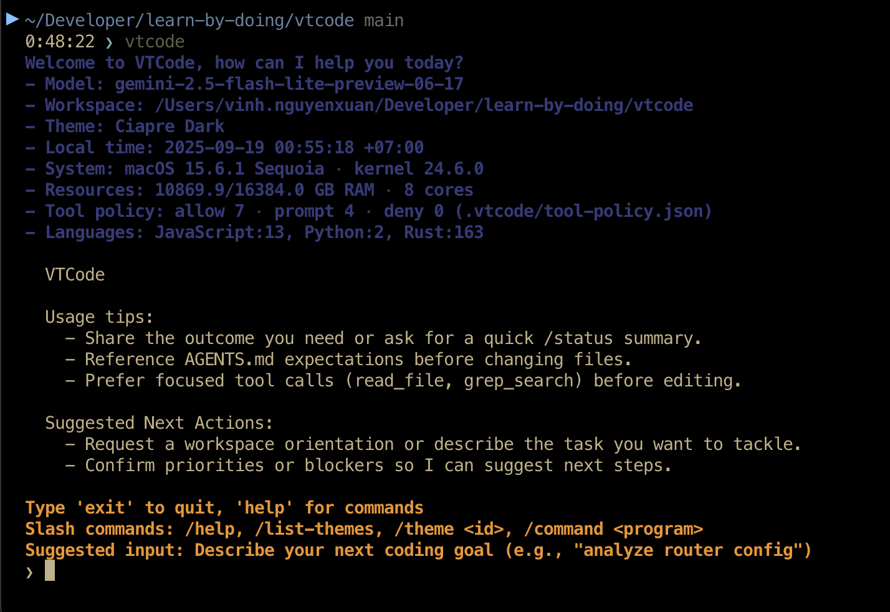

# VTCode - Coding Agent

[](https://github.com/vinhnx/vtcode/actions/workflows/tool-eval.yml)
[](https://crates.io/crates/vtcode)
[](https://www.npmjs.com/package/vtcode)
[](https://formulae.brew.sh/formula/vtcode)
[](https://github.com/vinhnx/vtcode/releases)
[](https://docs.rs/vtcode)
[](https://docs.rs/vtcode-core)

VTCode is a Rust-based terminal coding agent with modular architecture supporting multiple LLM providers (Gemini, OpenAI, Anthropic, DeepSeek) and tree-sitter parsers for 6+ languages. It provides a reliable, context-aware coding experience through intelligent tool integration and sophisticated prompt engineering.

<div align="center">
  
</div>

## Features

### Core Capabilities

-   **Single-Agent Reliability (default)**: Streamlined, linear agent with robust context engineering
-   **Decision Ledger**: Structured, compact record of key decisions injected each turn for consistency
-   **Multiple LLM Providers**: Gemini, OpenAI, Anthropic, DeepSeek support with latest models
-   **Advanced Code Analysis**: Tree-sitter parsers for Rust, Python, JavaScript, TypeScript, Go, Java
-   **Intelligent Tool Suite**: File operations, search, terminal commands, and PTY integration
-   **Configuration Management**: TOML-based configuration with comprehensive policies
-   **Safety & Security**: Path validation, command policies, and human-in-the-loop controls
-   **Workspace-First Automation**: Reads, writes, indexing, and shell execution anchored to `WORKSPACE_DIR` for project-aware actions

### Key Features

-   **Context Engineering**: Full conversation history with intelligent management and Decision Ledger
-   **Workspace Safety**: Path validation and configurable file exclusions
-   **Enhanced PTY Support**: Full terminal emulation for interactive commands
-   **Batch Operations**: Efficient multi-file processing and terminal command execution
-   **Configuration Flexibility**: Comprehensive TOML configuration for all aspects
-   **Single-Agent Coordination**: Reliable task execution with structured decision tracking
-   **Performance Monitoring**: Real-time metrics and benchmarking capabilities
-   **Router & Budgets**: Config-driven routing with per-class budgets
-   **Trajectory Logging**: JSONL logs for route decisions and tool calls
-   **Code Surgery Tools**: Srgn integration for syntax-aware code manipulation and refactoring
-   **Research-Preview Features**: Advanced context compression and conversation summarization

## Quick Start

### Prerequisites

**For pre-built installations (Cargo, Homebrew, npm):** None - binaries are ready to use.

**For building from source:**

-   Rust 1.75+ (stable)

**API Keys (required for all installation methods):**

-   `GEMINI_API_KEY` or `GOOGLE_API_KEY` for Gemini
-   `OPENAI_API_KEY` for OpenAI
-   `ANTHROPIC_API_KEY` for Anthropic
-   `DEEPSEEK_API_KEY` for DeepSeek

### Installation

Choose the installation method that best fits your needs:

#### 🚀 Cargo (crates.io) - Recommended for Rust developers

[](https://crates.io/crates/vtcode)
[](https://docs.rs/vtcode)

```bash
cargo install vtcode
```

-   **Documentation**: [docs.rs/vtcode](https://docs.rs/vtcode)
-   **Source**: [crates.io/crates/vtcode](https://crates.io/crates/vtcode)

#### 🍺 Homebrew (macOS)

[](https://formulae.brew.sh/formula/vtcode)

```bash
brew install vinhnx/tap/vtcode
```

-   **Tap Repository**: [vinhnx/homebrew-tap](https://github.com/vinhnx/homebrew-tap)
-   **Formula**: [vtcode.rb](https://github.com/vinhnx/homebrew-tap/blob/main/vtcode.rb)

#### 📦 npm (Cross-platform)

[](https://www.npmjs.com/package/vtcode)

```bash
npm install -g vtcode
```

-   **Package**: [npmjs.com/package/vtcode](https://www.npmjs.com/package/vtcode)
-   **Installation includes**: Pre-built binaries for your platform

#### 📥 Pre-built Binaries

[](https://github.com/vinhnx/vtcode/releases)

Download the latest release from [GitHub Releases](https://github.com/vinhnx/vtcode/releases) for your platform:

-   **Linux x64**: `vtcode-linux-x64.tar.gz`
-   **macOS x64**: `vtcode-macos-x64.tar.gz`
-   **macOS ARM64**: `vtcode-macos-arm64.tar.gz`
-   **Windows x64**: `vtcode-windows-x64.zip`

#### 🛠️ Build from Source

```bash
# Clone the repository
git clone https://github.com/vinhnx/vtcode.git
cd vtcode

# Build the project
cargo build --release

# Or use the provided scripts
./run.sh              # Production build + run
./run-debug.sh        # Development build + run
```

### 📚 Documentation

-   **API Documentation**: [docs.rs/vtcode](https://docs.rs/vtcode) | [docs.rs/vtcode-core](https://docs.rs/vtcode-core)
-   **User Guide**: [docs/user-guide/](docs/user-guide/)
-   **Configuration**: [docs/project/](docs/project/)
-   **Contributing**: [CONTRIBUTING.md](CONTRIBUTING.md)

### Basic Usage

```bash
# Set your API key
export GEMINI_API_KEY=your_api_key_here

# Confirm the workspace root the agent should treat as primary context
export WORKSPACE_DIR="$(pwd)"

# Initialize VTCode in your project
./run.sh init  # Creates vtcode.toml and .vtcodegitignore

# Start interactive chat
./run.sh chat

# Or run specific commands
cargo run -- chat

# Inspect the workspace root recognized by the agent
echo "Workspace root: $WORKSPACE_DIR"

# Launch with an alternate UI theme (ANSI palette)
cargo run -- chat --theme ciapre-blue

# Run with autonomous approvals (requires configuration safeguards)
cargo run -- chat --full-auto
```

### Workspace-Aware Operations

VTCode automatically treats the directory referenced by `WORKSPACE_DIR` as its primary context:

-   Read, write, and refactor files relative to the workspace without extra configuration.
-   Run shell commands and scripts inside the workspace, benefiting from PTY integration for interactive sessions.
-   Perform project indexing (directory scans, metadata extraction, dependency inspection) before large tasks to align with the live codebase.
-   Request confirmation before touching paths outside `WORKSPACE_DIR` or when downloading untrusted content.
-   Launch against a different project directory with `vtcode /path/to/project`; alternatively pass `--workspace-dir` (alias: `--workspace`) to other commands.

### UI Themes

VTCode ships with extensible ANSI themes to improve readability in different terminal setups. The default theme is **ciapre-dark**.

-   **CLI override:** `cargo run -- chat --theme ciapre-blue`
-   **Config file:** set `theme = "ciapre-dark"` under `[agent]` in `vtcode.toml`
-   **In-chat command:** type `/theme ciapre-blue` to switch without restarting
-   **Discover themes:** `/list-themes` lists available palettes; `/help` shows all slash commands

Themes are validated for contrast and map accent, background, foreground, and alert colors across the interface.

### Slash Commands

Use leading slash commands during chat to trigger common actions instantly:

-   `/help` – Quick reference of supported commands
-   `/list-themes` – Show available ANSI themes
-   `/theme <id>` – Switch the active theme (persists across sessions)
-   `/command <program> [args...]` – Run a shell command via `run_terminal_cmd`

Commands run without leaving the chat loop, and tool executions honor the same safety policies as automatic tool calls.

## Router & Budgets

Configure dynamic routing and per-class budgets in `vtcode.toml`:

```
[router]
enabled = true
heuristic_classification = true
llm_router_model = "gemini-2.5-flash-lite" # optional LLM router

[router.models]
simple = "gemini-2.5-flash-lite"
standard = "gemini-2.5-flash"
complex = "gemini-2.5-pro"
codegen_heavy = "gemini-2.5-flash"
retrieval_heavy = "gemini-2.5-flash"

[router.budgets.standard]
max_tokens = 2000
max_parallel_tools = 4
```

**Usage Notes:**

-   Enable LLM routing by setting `[router] llm_router_model = "<model-id>"`
-   Tune budgets by adding `[router.budgets.<class>]` with max_tokens and max_parallel_tools
-   Budgets apply to both provider-agnostic and Gemini-native request paths

## Trajectory Logging

Control logging via:

```
[telemetry]
trajectory_enabled = true
```

**Usage Notes:**

-   Logs for trajectory: check `logs/trajectory.jsonl`
-   Inspect with: `vtcode trajectory --top 10` (pretty summary)
-   Gate trajectory logging behind config flag: set `trajectory_enabled = false` to disable

## Usage Notes

### LLM Routing

To enable LLM routing: set `[router] llm_router_model = "<model-id>"`.

### Budget Tuning

To tune budgets: add `[router.budgets.<class>]` with max_tokens and max_parallel_tools.

### Trajectory Logs

Logs for trajectory: check `logs/trajectory.jsonl`.

### Full-Auto Mode

-   Requires enabling `[automation.full_auto]` in `vtcode.toml` and creating the acknowledgement profile.
-   Launch with `--full-auto` to skip confirmation prompts and rely on the configured tool allow-list.
-   See [docs/guides/full_auto_mode.md](docs/guides/full_auto_mode.md) for safeguards and recommended setup.

## Available Models & Providers

VTCode supports the latest models from multiple providers:

### Gemini (Google)

-   `gemini-2.5-flash-lite` - Fastest, most cost-effective (default)
-   `gemini-2.5-flash` - Fast, cost-effective
-   `gemini-2.5-pro` - Latest, most capable

### OpenAI

-   `gpt-5` - Latest GPT model

### Anthropic

-   `claude-sonnet-4-20250514` - Latest Claude model

## Command Reference

### Core Commands

#### `chat` - Interactive AI coding assistant

**Features:**
• Single-agent coordination with Decision Ledger for complex tasks
• Real-time code generation and editing
• Tree-sitter powered analysis
• Research-preview context management

**Usage:** `vtcode chat`

#### `ask <prompt>` - Single prompt mode

**Perfect for:**
• Quick questions
• Code explanations
• Simple queries

**Example:** `vtcode ask "Explain Rust ownership"`

#### `chat-verbose` - Verbose interactive chat

**Shows:**
• Tool execution details
• API request/response
• Decision Ledger tracking (in single-agent mode)
• Performance metrics

**Usage:** `vtcode chat-verbose`

#### `analyze` - Analyze workspace

**Provides:**
• Project structure analysis
• Language detection
• Code complexity metrics
• Dependency insights
• Symbol extraction

**Usage:** `vtcode analyze`

#### `performance` - Display performance metrics

**Shows:**
• Token usage and API costs
• Response times and latency
• Tool execution statistics
• Memory usage patterns
• Decision Ledger statistics (in single-agent mode)

**Usage:** `vtcode performance`

### Project Management

#### `init` - Initialize project

**Features:**
• Creates project directory structure
• Sets up config, cache, embeddings directories
• Creates .project metadata file
• Tree-sitter parser setup
• Context compression and Decision Ledger setup

**Usage:** `vtcode init`

#### `init-project` - Initialize project with dot-folder structure

**Features:**
• Creates project directory structure in ~/.vtcode/projects/
• Sets up config, cache, embeddings, and retrieval directories
• Creates .project metadata file
• Migrates existing config/cache files with user confirmation

**Examples:**

```
vtcode init-project
vtcode init-project --name my-project
vtcode init-project --force
```

#### `create-project <name> <features>` - Create complete Rust project

**Features:**
• Web frameworks (Axum, Rocket, Warp)
• Database integration
• Authentication systems
• Testing setup
• Tree-sitter integration

**Example:** `vtcode create-project my-api serde,axum,tokio`

### Advanced Features

#### `compress-context` - Compress conversation context

**Benefits:**
• Reduced token usage
• Faster responses
• Memory optimization
• Context preservation

**Usage:** `vtcode compress-context`

#### `benchmark` - Benchmark against SWE-bench

**Features:**
• Automated performance testing
• Comparative analysis across models
• Benchmark scoring and metrics
• Optimization insights

**Usage:** `vtcode benchmark`

### Snapshot Management

#### `snapshots` - List all available snapshots

**Shows:**
• Snapshot ID and turn number
• Creation timestamp
• Description
• File size and compression status

**Usage:** `vtcode snapshots`

#### `revert --turn <n>` - Revert to previous snapshot

**Features:**
• Revert to any previous turn
• Partial reverts (memory, context, full)
• Safe rollback with validation

**Examples:**

```
vtcode revert --turn 5
vtcode revert --turn 3 --partial memory
```

#### `cleanup-snapshots` - Clean up old snapshots

**Features:**
• Remove snapshots beyond limit
• Configurable retention policy
• Safe deletion with confirmation

**Examples:**

```
vtcode cleanup-snapshots
vtcode cleanup-snapshots --max 20
```

### Configuration Management

#### `config` - Generate configuration file

**Features:**
• Generate default configuration
• Support for global (home directory) and local configuration
• TOML format with comprehensive settings
• Context Ledger and compression configuration options
• Tree-sitter and performance monitoring settings

**Examples:**

```
vtcode config
vtcode config --output ./custom-config.toml
vtcode config --global
```

#### `tool-policy` - Manage tool execution policies

**Features:**
• Granular tool permissions
• Security level presets
• Audit logging
• Safe tool execution

**Examples:**

```
vtcode tool-policy status
vtcode tool-policy allow file-write
vtcode tool-policy deny shell-exec
```

#### `models` - Manage models and providers

**Features:**
• Support for latest models (DeepSeek, etc.)
• Provider configuration and testing
• Model performance comparison
• API key management

**Examples:**

```
vtcode models list
vtcode models set-provider deepseek
vtcode models set-model deepseek-reasoner
vtcode models test gemini
```

### Security & Analysis

#### `security` - Security and safety management

**Features:**
• Security scanning and vulnerability detection
• Audit logging and monitoring
• Access control management
• Privacy protection settings

**Usage:** `vtcode security`

#### `tree-sitter` - Tree-sitter code analysis tools

**Features:**
• AST-based code parsing
• Symbol extraction and navigation
• Code complexity analysis
• Multi-language refactoring

**Usage:** `vtcode tree-sitter`

#### `man` - Generate man pages

**Features:**
• Generate Unix man pages for all commands
• Display detailed command documentation
• Save man pages to files
• Comprehensive help for all VTCode features

**Examples:**

```
vtcode man
vtcode man chat
vtcode man chat --output chat.1
```

#### `srgn` - Code surgery tool

**Features:**
• Syntax-aware code manipulation using tree-sitter parsers
• Multi-language support (Rust, Python, JavaScript/TypeScript, Go, C/C++, C#, HCL)
• Advanced operations: replace, delete, case conversion, Unicode normalization
• Language grammar-aware scoping for precise modifications
• Custom tree-sitter queries for complex patterns
• Bulk operations across multiple files with glob patterns
• Dry-run mode for safe testing
• Parallel processing for high performance

**Usage:** Available through natural language chat interface

**Examples:**

-   "Replace println with eprintln in all Rust files"
-   "Convert all Python print statements to logging"
-   "Find all unsafe blocks in Rust code"
-   "Normalize Unicode characters in documentation"
-   "Convert ASCII arrows to Unicode arrows"
-   "Apply German umlaut substitutions"

**Advanced Features:**
• Custom tree-sitter query support
• Fail-safe validation with fail-any/fail-none
• Multi-scope operations with join mode
• Deterministic output with sorted processing
• Hidden file and gitignore handling

## Architecture

### Core Components

-   **`vtcode-core/`**: Library crate with core functionality
-   **`src/`**: Binary crate with CLI interface
-   **`prompts/`**: System prompts for different agent types
-   **`docs/`**: Comprehensive documentation
-   **Tool specs**: see `docs/tools/TOOL_SPECS.md` for schemas, examples, and limits
-   **`examples/`**: Usage examples and demonstrations

### Agent Types

#### Orchestrator Agent

-   **Strategic coordinator** managing complex development tasks
-   **Task delegation** to specialized subagents
-   **Context management** and knowledge accumulation
-   **Verification workflows** ensuring implementation quality

#### Explorer Agent

-   **Read-only investigator** for understanding and verification
-   **System exploration** and configuration discovery
-   **Implementation verification** of coder agent work
-   **Structured reporting** through context accumulation

#### Coder Agent

-   **Implementation specialist** with full write access
-   **Code generation** and modification capabilities
-   **Technical sophistication** in debugging and optimization
-   **Quality assurance** through comprehensive testing

## Configuration

VTCode uses a comprehensive TOML configuration system loaded from `vtcode.toml`:

### Basic Configuration

```toml
# Agent behavior settings
[agent]
model = "gemini-2.5-flash-lite"
max_conversation_turns = 1000
verbose_logging = false

# Security and safety settings
[security]
human_in_the_loop = true
confirm_destructive_actions = true
max_file_size_mb = 50

# Tool execution policies
[tools]
default_policy = "prompt"

[tools.policies]
read_file = "allow"
write_file = "prompt"
run_terminal_cmd = "prompt"

# Command permissions
[commands]
allow_list = ["ls", "pwd", "cat", "git status", "cargo check"]
deny_list = ["rm -rf", "sudo rm", "shutdown"]

# PTY configuration
[pty]
enabled = true
default_rows = 24
default_cols = 80
command_timeout_seconds = 300
```

### Configuration Commands

```bash
# Initialize with default configuration
./run.sh init

# Generate complete configuration (preserves existing settings)
./run.sh config

# Generate configuration and save to specific file
./run.sh config --output my-config.toml

# Copy example configuration
cp vtcode.toml.example vtcode.toml

# Validate configuration
./run.sh config --validate
```

**Configuration Generation**: The `config` command implements two-way synchronization:

-   **Reads existing `vtcode.toml`** if present, preserving your customizations
-   **Generates complete TOML** with all sections, even missing ones
-   **Falls back to defaults** if no configuration exists
-   **Ensures consistency** between your config file and generated templates

## Tool Suite

### File Operations

-   `list_files(path?)` - Explore directories with metadata
-   `read_file(path, start_line?, end_line?)` - Read text files with line control
-   `write_file(path, content)` - Create or overwrite files
-   `edit_file(path, old_string, new_string)` - Surgical file editing

### Search & Analysis

-   `rp_search(pattern, path?)` - Fast text search using ripgrep
-   `grep_search(pattern, include_pattern?)` - Advanced regex search
-   `ast_grep_search(pattern, language?)` - Syntax-aware code search

### Terminal Integration

-   `run_terminal_cmd(command)` - Execute terminal commands
-   `run_in_terminal(command, is_background?)` - Enhanced terminal execution

### PTY Support

-   `configure_notebook(file_path)` - Configure Jupyter notebook kernels
-   `run_notebook_cell(cell_id, file_path)` - Execute notebook cells
-   `read_notebook_cell_output(cell_id, file_path)` - Read cell execution results

### Color Utilities

VTCode now includes advanced color manipulation capabilities through the `coolor` crate integration:

-   RGB to ANSI color conversion for terminal compatibility
-   HSL color space support for intuitive color manipulation
-   Color blending and harmonious color scheme generation
-   Lighten/darken operations for dynamic color adjustments

These utilities are available through the `vtcode_core::utils::colors` module for developers extending VTCode's functionality.

## Usage Examples

### Basic Chat Session

```bash
# Start interactive chat with tools
./run.sh chat

# Single question mode (no tools)
./run.sh ask "Explain Rust ownership"

# Verbose chat with detailed logging
./run.sh chat-verbose
```

### Project Analysis

```bash
# Analyze current project structure
./run.sh analyze

# Display performance metrics
./run.sh performance
```

### Project Creation

```bash
# Create new Rust project with features
./run.sh create-project my-api serde,axum,tokio

# Available features: web frameworks, databases, async runtimes, etc.
```

### Context Management

```bash
# Compress conversation context for long sessions
./run.sh compress-context

# Demo async file operations
./run.sh demo-async
```

### Snapshot Management

```bash
# List all available snapshots
./run.sh snapshots

# Revert to previous turn
./run.sh revert --turn 5

# Clean up old snapshots (keep last 20)
./run.sh cleanup-snapshots --max 20
```

### Configuration Management

```bash
# Initialize project with configuration
./run.sh init

# Manage tool policies
./run.sh tool-policy status
./run.sh tool-policy allow read_file
./run.sh tool-policy deny run_terminal_cmd

# Manage models and providers
./run.sh models list
./run.sh models set-provider openai
./run.sh models set-model gpt-5
./run.sh models test gemini
```

## Global Options

VTCode supports several global options that can be used with any command:

### Model & Provider Options

-   `--model <MODEL>` - Specify LLM model (e.g., `gemini-2.5-flash-lite`)
-   `--provider <PROVIDER>` - Specify LLM provider (e.g., `gemini`, `openai`, `anthropic`, `deepseek`)
-   `--api-key-env <ENV_VAR>` - Specify API key environment variable

### Feature Flags

-   `--enable-tree-sitter` - Enable tree-sitter code analysis
-   `--performance-monitoring` - Enable performance monitoring
-   `--research-preview` - Enable research-preview features

### Security & Safety

-   `--security-level <LEVEL>` - Set security level (`strict`, `moderate`, `permissive`)
-   `--max-concurrent-ops <NUM>` - Maximum concurrent operations (default: 5)
-   `--max-tool-calls <NUM>` - Maximum tool calls per session (default: 10)

### Output & Logging

-   `--verbose` - Enable verbose logging
-   `--debug` - Enable debug output
-   `--log-level <LEVEL>` - Set log level (`error`, `warn`, `info`, `debug`, `trace`)
-   `--no-color` - Disable color output
-   `--show-file-diffs` - Show file diffs in chat interface

### System Configuration

-   `--workspace <PATH>` - Set workspace root directory
-   `--config <PATH>` - Specify configuration file path
-   `--skip-confirmations` - Skip safety confirmations

## Contributing

VTCode is an open-source project. Contributions are welcome! Please see our [contributing guidelines](CONTRIBUTING.md) for details.

## License

Licensed under the MIT License. See [LICENSE](LICENSE) for details.

### Tool Loop Guard

-   **Config key**: `[tools].max_tool_loops`
-   **Purpose**: Prevents infinite tool-calling cycles by limiting how many tool→respond iterations the agent performs per user turn.
-   **Default**: `100`

Example:

```toml
[tools]
default_policy = "prompt"
max_tool_loops = 100
```

When a turn hits this guard, the chat UI now surfaces a clear error explaining that tool execution stopped and points you to `[tools].max_tool_loops` in `vtagent.toml` so you can raise the limit before retrying.

### Distribution & Releases

VTCode supports multiple distribution channels for easy installation:

#### Release Process

The project uses an automated release script that handles publishing to multiple package managers:

```bash
# Create a patch release (increments 0.1.0 → 0.1.1)
./scripts/release.sh --patch

# Create a minor release (increments 0.1.0 → 0.2.0)
./scripts/release.sh --minor

# Create a major release (increments 0.1.0 → 1.0.0)
./scripts/release.sh --major

# Release a specific version
./scripts/release.sh 1.0.0

# Dry run to see what would happen
./scripts/release.sh --patch --dry-run

# Skip certain distribution channels
./scripts/release.sh --patch --skip-npm --skip-homebrew
```

#### Distribution Channels

VTCode is available through multiple package managers for easy installation:

1. **🚀 [Cargo (crates.io)](https://crates.io/crates/vtcode)**: `cargo install vtcode`

    - **API Docs**: [docs.rs/vtcode](https://docs.rs/vtcode)
    - **Source**: [crates.io/crates/vtcode](https://crates.io/crates/vtcode)

2. **📦 [npm](https://www.npmjs.com/package/vtcode)**: `npm install -g vtcode`

    - **Package**: [npmjs.com/package/vtcode](https://www.npmjs.com/package/vtcode)

3. **🍺 [Homebrew](https://formulae.brew.sh/formula/vtcode)**: `brew install vinhnx/tap/vtcode`

    - **Tap**: [vinhnx/homebrew-tap](https://github.com/vinhnx/homebrew-tap)

4. **📥 [GitHub Releases](https://github.com/vinhnx/vtcode/releases)**: Pre-built binaries
    - **Linux x64, macOS x64/ARM64, Windows x64**
    - **Direct download**: [github.com/vinhnx/vtcode/releases](https://github.com/vinhnx/vtcode/releases)

#### Core Library

-   **vtcode-core**: [crates.io/crates/vtcode-core](https://crates.io/crates/vtcode-core)
-   **API Docs**: [docs.rs/vtcode-core](https://docs.rs/vtcode-core)
