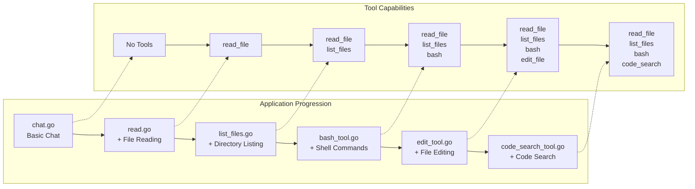
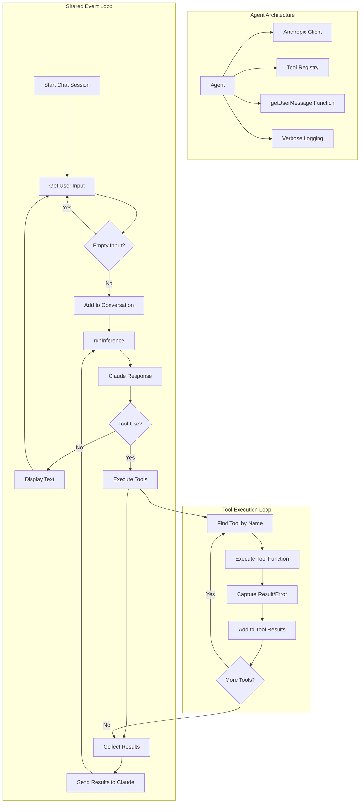

<https://github.com/ratatui/ratatui>
TUI

--

run some lt-bench agent benchmark to test agent capability. then update the the report in readme. checking for existing benchs

--

<https://app.primeintellect.ai/dashboard/environments>

--

run codex init

--

allow list

--

code terminal sandbox

--

use vercel ai-gateway, cloudflare ai gateway, openrouter or litellm

--

- [ ] Build a CLI tool that generates a structured TODO list for any user-supplied task description
  - [ ] Accept a task description as input (via CLI argument or prompt)
  - [ ] Parse the task into actionable subtasks using LLM or rule-based logic
  - [ ] Output the TODO list in markdown format
  - [ ] Support output to file or stdout
  - [ ] Allow user to edit or reorder generated TODO items before saving
  - [ ] Integrate with existing agent context and preferences (e.g., AGENTS.md)
  - [ ] Add tests for various input scenarios and edge cases
  - [ ] Document usage with examples in README.md

--

- [ ] Update documentation and README.md to reflect all recent changes, including new features, configuration options, and usage instructions.
- [ ] Add a comprehensive usage guide to the README.md, covering setup, available commands, configuration via AGENTS.md, and example workflows.
- [ ] Ensure all documented commands and options match the current implementation.
- [ ] Review and update any outdated instructions or references in both documentation and README.md.

--

--

reference implement this guide and apply to our agent, but exclude aws

The wave of CLI Coding Agents

If you have tried Claude Code, Gemini Code, Open Code or Simon Willison’s LLM CLI, you’ve experienced something fundamentally different from ChatGPT or Github Copilot. These aren’t just chatbots or autocomplete tools - they’re agents that can read your code, run your tests, search docs and make changes to your codebase async.

But how do they work? For me the best way to understand how any tool works is to try and build it myself. So that’s exactly what we did, and in this article I’ll take you through how we built our own CLI Coding Agent using the Pydantic-AI framework and the Model Context Protocol (MCP). You’ll see not just how to assemble the pieces but why each capability matters and how it changes the way you can work with code.

Before diving into the technical implementation, let's examine why we chose to build our own solution.

The answer became clear very quickly using our custom agent, while commercial tools are impressive, they’re built for general use cases. Our agent was fully customised to our internal context and all the little eccentricities of our specific project. More importantly, building it gave us insights into how these systems work and the quality of our own GenAI Platform and Dev Tooling.

Think of it like learning to cook. You can eat at restaurants forever but understanding how flavours combine and techniques work makes you appreciate food differently - and lets you create exactly what you want.
The Architecture of Our Development Agent

At a high level, our coding assistant consists of several key components:

    Pydantic-AI Framework: provides the agent framework and many helpful utilities to make our Agent more useful immediately
    MCP Servers: independent processes that give the agent specialised tools, MCP is a common standard for defining the servers that contain these tools.
    CLI Interface: how users interact with the assistant

The magic happens through the Model Context Protocol (MCP), which allows the AI model to use various tools through a standardized interface. This architecture makes our assistant highly extensible - we can easily add new capabilities by implementing additional MCP servers, but we’re getting ahead of ourselves.
Starting Simple: The Foundation

We started by creating a basic project structure and installing the necessary dependencies:

uv init
uv add pydantic_ai
uv add boto3

Our primary dependencies include:

    pydantic-ai: Framework for building AI agents

Here's how we configured it in our main.py:

import boto3
from pydantic_ai import Agent
from pydantic_ai.mcp import MCPServerStdio
from pydantic_ai.models.bedrock import BedrockConverseModel
from pydantic_ai.providers.bedrock import BedrockProvider

bedrock_config = BotocoreConfig(
    read_timeout=300,
    connect_timeout=60,
    retries={"max_attempts": 3},
)
bedrock_client = boto3.client(
    "bedrock-runtime", region_name="eu-central-1", config=bedrock_config
)
model = BedrockConverseModel(
    "eu.anthropic.claude-sonnet-4-20250514-v1:0",
    provider=BedrockProvider(bedrock_client=bedrock_client),
)
agent = Agent(
    model=model,
)

if **name** == "**main**":
  agent.to_cli_sync()

At this stage we already have a fully working CLI with a chat interface which we can use as you would a GUI chat interface, which is pretty cool for how little code this is! However we can definitely improve upon this.
First Capability: Testing!

Instead of running the tests ourselves after each coding iteration why not get the agent to do it? Seems simple right?

import subprocess

@agent.tool_plain()
def run_unit_tests() -> str:
    """Run unit tests using uv."""
    result = subprocess.run(
        ["uv", "run", "pytest", "-xvs", "tests/"], capture_output=True, text=True
    )
    return result.stdout

Here we use the same pytest command you would run in the terminal (I’ve shortened ours for the article). Now something magical happened. I could say “X isn’t working” and the agent would:

    1. Run the test suite
    2. Identify which specific tests were failing
    3. Analyze the error messages
    4. Suggest targeted fixes.

The workflow change: Instead of staring at test failures or copy pasting terminal outputs into ChatGPT we now give our agent super relevant context about any issues in our codebase.

However we noticed our agent sometimes “fixed” failing tests by suggesting changes to the tests, not the actual implementation. This led to our next addition.
Adding Intelligence: Instructions and intent

We realised we needed to teach our agent a little more about our development philosophy and steer it away from bad behaviours.

instructions = """
You are a specialised agent for maintaining and developing the XXXXXX codebase.

## Development Guidelines

1. **Test Failures:**
   - When tests fail, fix the implementation first, not the tests
   - Tests represent expected behavior; implementation should conform to tests
   - Only modify tests if they clearly don't match specifications

2. **Code Changes:**
   - Make the smallest possible changes to fix issues
   - Focus on fixing the specific problem rather than rewriting large portions
   - Add unit tests for all new functionality before implementing it

3. **Best Practices:**
   - Keep functions small with a single responsibility
   - Implement proper error handling with appropriate exceptions
   - Be mindful of configuration dependencies in tests

Remember to examine test failure messages carefully to understand the root cause before making any changes.
"""

agent = Agent(
instructions=instructions,
model=model,
)

The workflow change: The agent now understands our values around Test Driven Development and minimal changes. It stopped suggesting large refactors where a small fix would do (Mostly).

Now while we could continue building everything from absolute scratch and tweaking our prompts for days we want to go fast and use some tools other people have built - Enter Model Context Protocol (MCP).
The MCP Revolution: Pluggable Capabilities

This is where our agent transformed from a helpful assistant to something approaching the commercial CLI agents. The Model Context Protocol (MCP) allows us to add sophisticated capabilities by running specialized servers.

    MCP is an open protocol that standardizes how applications provide context to LLMs. Think of MCP like a USB-C port for AI applications. Just as USB-C provides a standardized way to connect your devices to various peripherals and accessories, MCP provides a standardized way to connect AI models to different data sources and tools.

    -- MCP Introduction

We can run these servers as a local process, so no data sharing, where we interact with STDIN/STDOUT to keep things simple and local. (More details on tools and MCP)
Sandboxed Python Execution

Using large language models to do calculations or executing arbitrary code they create is not effective and potentially very dangerous! To make our Agent more accurate and safe our first MCP addition was Pydantic Al’s default server for sandboxed Python code execution:

run_python = MCPServerStdio(
    "deno",
    args=[
        "run",
        "-N",
        "-R=node_modules",
        "-W=node_modules",
        "--node-modules-dir=auto",
        "jsr:@pydantic/mcp-run-python",
        "stdio",
    ],
)

agent = Agent(
    ...
    mcp_servers=[
        run_python
    ],
)

This gave our agent a sandbox where it could test ideas, prototype solutions, and verify its own suggestions.

NOTE: This is very different from running the tests where we need the local environment and is intended to be used to make calculations much more robust. This is because writing the code to output a number and then executing that code is much more reliable and understandable, scalable and repeatable than just generating the next token in a calculation. We have seen from frontier labs (including their leaked instructions) that this is a much better approach.

The workflow change: Doing calculations, even more complex ones, became significantly more reliable. This is useful for many things like dates, sums, counts etc. It also allows for a rapid iteration cycle of simple python code.
Up-to-Date library Documentation

LLMs are mostly trained in batch on historical data this gives a fixed cutoff while languages and dependencies continue to change and improve so we added Context7 for access to up to date python library documentation in LLM consumable format:

context7 = MCPServerStdio(
    command="npx", args=["-y", "@upstash/context7-mcp"], tool_prefix="context"
)

The workflow change: When working with newer libraries or trying to use Research-preview features, the agent could look up current documentation rather than relying on potentially outdated training data. This made it much more reliable for real-world development work.
Internet Search for Current Information

Sometimes you need information that's not in any documentation—recent Stack Overflow discussions, GitHub issues, or the latest best practices. We added general internet search:

internet_search = MCPServerStdio(command="uvx", args=["duckduckgo-mcp-server"])

The workflow change: When encountering obscure errors or needing to understand recent changes in the ecosystem, the agent could search for current discussions and solutions. This was particularly valuable for debugging deployment issues or understanding breaking changes in dependencies.
Structured Problem Solving

One of the most valuable additions was the code reasoning MCP, which helps the agent think through complex problems systematically:

code_reasoning = MCPServerStdio(
    command="npx",
    args=["-y", "@mettamatt/code-reasoning"],
    tool_prefix="code_reasoning",
)

The workflow change: Instead of jumping to solutions, the agent would break down complex problems into logical steps, explore alternative approaches, and explain its reasoning. This was invaluable for architectural decisions and debugging complex issues. I could ask “Why is this API call failing intermittently?” and get a structured analysis of potential causes rather than just guesses.
Optimising for Reasoning

As we added more sophisticated capabilities, we noticed that reasoning and analysis tasks often took much longer than regular text generation—especially when the output wasn't correctly formatted on the first try. We adjusted our Bedrock configuration to be more patient:

bedrock_config = BotocoreConfig(
    read_timeout=300,
    connect_timeout=60,
    retries={"max_attempts": 3},
)
bedrock_client = boto3.client(
    "bedrock-runtime", region_name="eu-central-1", config=bedrock_config
)

The workflow change: The longer timeouts meant our agent could work through complex problems without timing out. When analyzing large codebases or reasoning through intricate architectural decisions, the agent could take the time needed to provide thorough, well-reasoned responses rather than rushing to incomplete solutions.
Desktop Commander: Warning! With great power comes great responsibility!

At this point, our agent was already quite capable—it could reason through problems, execute code, search for information, and . This MCP server transforms your agent from a helpful assistant into something that can actually do things in your development environment:

desktop_commander = MCPServerStdio(
    command="npx",
    args=["-y", "@wonderwhy-er/desktop-commander"],
    tool_prefix="desktop_commander",
)

Desktop Commander provides an incredibly comprehensive toolkit: file system operations (read, write, search), terminal command execution with process management, surgical code editing with edit_block, and even interactive REPL sessions. It's built on top of the MCP Filesystem Server but adds crucial capabilities like search-and-replace editing and intelligent process control.

The workflow change: This is where everything came together. I could now say “The authentication tests are failing, please fix the issue” and the agent would:

    1. Run the test suite to see the specific failures
    2. Read the failing test files to understand what was expected
    3. Examine the authentication module code
    4. Search the codebase for related patterns
    5. Look up the documentation for the relevant library
    6. Make edits to fix the implementation
    7. Re-run the tests to verify the fix
    8. Search for similar patterns elsewhere that might need updating

All of this happened in a single conversation thread, with the agent maintaining context throughout. It wasn't just generating code suggestions—it was actively debugging, editing, and verifying fixes like a pair programming partner.

The security model is thoughtful too, with configurable allowed directories, blocked commands, and proper permission boundaries. You can learn more about its extensive capabilities at the Desktop Commander documentation.
The Complete System

Here's our final agent configuration:

import asyncio

import subprocess
import boto3
from pydantic_ai import Agent
from pydantic_ai.mcp import MCPServerStdio
from pydantic_ai.models.bedrock import BedrockConverseModel
from pydantic_ai.providers.bedrock import BedrockProvider
from botocore.config import Config as BotocoreConfig

bedrock_config = BotocoreConfig(
    read_timeout=300,
    connect_timeout=60,
    retries={"max_attempts": 3},
)
bedrock_client = boto3.client(
    "bedrock-runtime", region_name="eu-central-1", config=bedrock_config
)
model = BedrockConverseModel(
    "eu.anthropic.claude-sonnet-4-20250514-v1:0",
    provider=BedrockProvider(bedrock_client=bedrock_client),
)
agent = Agent(
    model=model,
)

instructions = """
You are a specialised agent for maintaining and developing the XXXXXX codebase.

## Development Guidelines

1. **Test Failures:**
   - When tests fail, fix the implementation first, not the tests
   - Tests represent expected behavior; implementation should conform to tests
   - Only modify tests if they clearly don't match specifications

2. **Code Changes:**
   - Make the smallest possible changes to fix issues
   - Focus on fixing the specific problem rather than rewriting large portions
   - Add unit tests for all new functionality before implementing it

3. **Best Practices:**
   - Keep functions small with a single responsibility
   - Implement proper error handling with appropriate exceptions
   - Be mindful of configuration dependencies in tests

Remember to examine test failure messages carefully to understand the root cause before making any changes.
"""

run_python = MCPServerStdio(
    "deno",
    args=[
        "run",
        "-N",
        "-R=node_modules",
        "-W=node_modules",
        "--node-modules-dir=auto",
        "jsr:@pydantic/mcp-run-python",
        "stdio",
    ],
)

internet_search = MCPServerStdio(command="uvx", args=["duckduckgo-mcp-server"])
code_reasoning = MCPServerStdio(
    command="npx",
    args=["-y", "@mettamatt/code-reasoning"],
    tool_prefix="code_reasoning",
)
desktop_commander = MCPServerStdio(
    command="npx",
    args=["-y", "@wonderwhy-er/desktop-commander"],
    tool_prefix="desktop_commander",
)
context7 = MCPServerStdio(
    command="npx", args=["-y", "@upstash/context7-mcp"], tool_prefix="context"
)

agent = Agent(
    instructions=instructions,
    model=model,
    mcp_servers=[
        run_python,
        internet_search,
        code_reasoning,
        context7,
        desktop_commander,
    ],
)

@agent.tool_plain()
def run_unit_tests() -> str:
    """Run unit tests using uv."""
    result = subprocess.run(
        ["uv", "run", "pytest", "-xvs", "tests/"], capture_output=True, text=True
    )
    return result.stdout

async def main():
    async with agent.run_mcp_servers():
        await agent.to_cli()

if **name** == "**main**":
    asyncio.run(main())

How it changes our workflow:

    Debugging becomes collaborative: you have an intelligent partner that can analyze error messages, suggest hypotheses, and help test solutions.
    Learning accelerates: when working with unfamiliar libraries or patterns, the agent can explain existing code, suggest improvements, and teach you why certain approaches work better.
    Context switching reduces: rather than jumping between documentation, Stack Overflow, and your IDE, you have a single interface that can access all these resources while maintaining context about your specific problem.
    Problem-solving becomes structured: rather than jumping to solutions, the agent can break down complex issues into logical steps, explore alternatives, and explain its reasoning. Like having a real life talking rubber duck!
    Code review improves: the agent can review your changes, spot potential issues, and suggest improvements before you commit—like having a senior developer looking over your shoulder.

What We Learned About CLI Agents

Building our own agent revealed several insights about this emerging paradigm:

    MCP is (almost) all you need: the magic isn't in any single capability, but in how they work together. The agent that can run tests, read files, search documentation, execute code, and reason through problems systematically becomes qualitatively different from one that can only do any single task.
    Current information is crucial: having access to real-time search and up-to-date documentation makes the agent much more reliable for real-world development work where training data might be outdated.
    Structured thinking matters: the code reasoning capability transforms the agent from a clever autocomplete into a thinking partner that can break down complex problems and explore alternative solutions.
    Context is king: commercial agents like Claude Code are impressive partly because they maintain context across all these different tools. Your agent needs to remember what it learned from the test run when it's making file changes.
    Specialisation matters: our agent works better for our specific codebase than general-purpose tools because it understands our patterns, conventions, and tool preferences. If it falls short in any area then we can go and make the required changes.

--

--

## Safe Code Sandbox Execution Workflow

To ensure safe code execution and prevent dangerous operations (such as `rm`, file system modifications, or network access), implement the following workflow for sandboxed code execution:

1. **Use a Dedicated Sandbox Environment**
   - Run all untrusted or user-submitted code in a restricted environment (e.g., Docker container, Firejail, or a custom chroot jail).
   - The sandbox should have:
     - No access to the host file system (except for a temporary working directory).
     - No network access unless explicitly required and safe.
     - Limited CPU and memory resources.

2. **Command Filtering and Validation**
   - Before executing any shell command or script, scan for dangerous patterns such as:
     - `rm`, `mv`, `dd`, `shutdown`, `reboot`, `mkfs`, `:(){ :|:& };:`, etc.
     - Wildcards that could escalate scope (e.g., `rm -rf /`).
   - Reject or sanitize any command containing these patterns.

   **Example (Python pseudocode):**

   ```
   forbidden = ["rm", "mv", "dd", "shutdown", "reboot", "mkfs", ":", ">", "<", "|", "&", ";"]
   if any(f in user_command for f in forbidden):
       raise Exception("Dangerous command detected. Execution blocked.")
   ```

3. **Read-Only File System**
   - Mount the code execution directory as read-only, except for a specific temp directory for outputs.
   - Do not allow code to write outside this directory.

4. **No Privileged Execution**
   - Never run code as root or with elevated privileges inside the sandbox.

5. **Audit and Logging**
   - Log all commands executed in the sandbox for audit and debugging.
   - Alert on any attempt to run forbidden commands.

6. **Timeouts and Resource Limits**
   - Set strict timeouts for code execution (e.g., 10 seconds).
   - Limit CPU and memory usage to prevent abuse.

7. **Example: Docker-based Sandbox (Bash)**

   ```
   docker run --rm \
     --network none \
     --cpus="0.5" \
     --memory="256m" \
     -v /tmp/sandbox:/sandbox:ro \
     my-sandbox-image \
     /sandbox/run_code.sh
   ```

8. **Review and Update**
   - Regularly review the list of forbidden commands and sandbox configuration.
   - Update as new threats or requirements emerge.

**Never** allow direct execution of arbitrary shell commands from user input without these safeguards.

---

### TL;DR

Agents need context to perform tasks. Context engineering is the art and science of filling the context window with just the right information at each step of an agent’s trajectory. In this post, I group context engineering into a few common strategies seen across many popular agents today.


### Context Engineering

As Andrej Karpathy puts it, LLMs are like a [new kind of operating system](https://www.youtube.com/watch?si=-aKY-x57ILAmWTdw&t=620&v=LCEmiRjPEtQ&feature=youtu.be). The LLM is like the CPU and its [context window](https://docs.anthropic.com/en/docs/build-with-claude/context-windows) is like the RAM, serving as the model’s working memory. Just like RAM, the LLM context window has limited [capacity](https://lilianweng.github.io/posts/2023-06-23-agent/) to handle various sources of context. And just as an operating system curates what fits into a CPU’s RAM, “context engineering” plays a similar role. [Karpathy summarizes this well](https://x.com/karpathy/status/1937902205765607626):

> \[Context engineering is the\] ”…delicate art and science of filling the context window with just the right information for the next step.”


What are the types of context that we need to manage when building LLM applications? Context engineering is an [umbrella](https://x.com/dexhorthy/status/1933283008863482067) that applies across a few different context types:

- **Instructions** – prompts, memories, few‑shot examples, tool descriptions, etc
- **Knowledge** – facts, memories, etc
- **Tools** – feedback from tool calls

### Context Engineering for Agents

This year, interest in [agents](https://www.anthropic.com/engineering/building-effective-agents) has grown tremendously as LLMs get better at [reasoning](https://platform.openai.com/docs/guides/reasoning?api-mode=responses) and [tool calling](https://www.anthropic.com/engineering/building-effective-agents). [Agents](https://www.anthropic.com/engineering/building-effective-agents) interleave [LLM invocations and tool calls](https://www.anthropic.com/engineering/building-effective-agents), often for [long-running tasks](https://blog.langchain.com/introducing-ambient-agents/).


However, long-running tasks and accumulating feedback from tool calls mean that agents often utilize a large number of tokens. This can cause numerous problems: it can [exceed the size of the context window](https://cognition.ai/blog/kevin-32b), balloon cost / latency, or degrade agent performance. Drew Breunig [nicely outlined](https://www.dbreunig.com/2025/06/22/how-contexts-fail-and-how-to-fix-them.html) a number of specific ways that longer context can cause perform problems, including:

- [Context Poisoning: When a hallucination makes it into the context](https://www.dbreunig.com/2025/06/22/how-contexts-fail-and-how-to-fix-them.html#context-poisoning)
- [Context Distraction: When the context overwhelms the training](https://www.dbreunig.com/2025/06/22/how-contexts-fail-and-how-to-fix-them.html#context-distraction)
- [Context Confusion: When superfluous context influences the response](https://www.dbreunig.com/2025/06/22/how-contexts-fail-and-how-to-fix-them.html#context-confusion)
- [Context Clash: When parts of the context disagree](https://www.dbreunig.com/2025/06/22/how-contexts-fail-and-how-to-fix-them.html#context-clash)

With this in mind, [Cognition](https://cognition.ai/blog/dont-build-multi-agents) called out the importance of context engineering:

> *“Context engineering” … is effectively the #1 job of engineers building AI agents.*

[Anthropic](https://www.anthropic.com/engineering/built-multi-agent-research-system) also laid it out clearly:

> *Agents often engage in conversations spanning hundreds of turns, requiring careful context management strategies.*

So, how are people tackling this challenge today? I group approaches into 4 buckets — **write, select, compress, and isolate —** and give some examples of each one below.


### Write Context

*Writing context means saving it outside the context window to help an agent perform a task.*

**Scratchpads**

When humans solve tasks, we take notes and remember things for future, related tasks. Agents are also gaining these capabilities! Note-taking via a “ [scratchpad](https://www.anthropic.com/engineering/claude-think-tool) ” is one approach to persist information while an agent is performing a task. The central idea is to save information outside of the context window so that it’s available to the agent. [Anthropic’s multi-agent researcher](https://www.anthropic.com/engineering/built-multi-agent-research-system) illustrates a clear example of this:

> *The LeadResearcher begins by thinking through the approach and saving its plan to Memory to persist the context, since if the context window exceeds 200,000 tokens it will be truncated and it is important to retain the plan.*

Scratchpads can be implemented in a few different ways. They can be a [tool call](https://www.anthropic.com/engineering/claude-think-tool) that simply [writes to a file](https://github.com/modelcontextprotocol/servers/tree/main/src/filesystem). It could also just be a field in a runtime [state object](https://langchain-ai.github.io/langgraph/concepts/low_level/#state) that persists during the session. In either case, scratchpads let agents save useful information to help them accomplish a task.

**Memories**

Scratchpads help agents solve a task within a given session, but sometimes agents benefit from remembering things across *many* sessions. [Reflexion](https://arxiv.org/abs/2303.11366) introduced the idea of reflection following each agent turn and re-using these self-generated memories. [Generative Agents](https://ar5iv.labs.arxiv.org/html/2304.03442) created memories synthesized periodically from collections of past agent feedback.

These concepts made their way into popular products like [ChatGPT](https://help.openai.com/en/articles/8590148-memory-faq), [Cursor](https://forum.cursor.com/t/0-51-memories-feature/98509), and [Windsurf](https://docs.windsurf.com/windsurf/cascade/memories), which all have mechanisms to auto-generate long-term memories based on user-agent interactions.


### Select Context

*Selecting context means pulling it into the context window to help an agent perform a task.*

**Scratchpad**

The mechanism for selecting context from a scratchpad depends upon how the scratchpad is implemented. If it’s a [tool](https://www.anthropic.com/engineering/claude-think-tool), then an agent can simply read it by making a tool call. If it’s part of the agent’s runtime state, then the developer can choose what parts of state to expose to an agent each step. This provides a fine-grained level of control for exposing scratchpad context to the LLM at later turns.

**Memories**

If agents have the ability to save memories, they also need the ability to select memories relevant to the task they are performing. This can be useful for a few reasons. Agents might select few-shot examples ([episodic](https://langchain-ai.github.io/langgraph/concepts/memory/#memory-types) [memories](https://arxiv.org/pdf/2309.02427)) for examples of desired behavior, instructions ([procedural](https://langchain-ai.github.io/langgraph/concepts/memory/#memory-types) [memories](https://arxiv.org/pdf/2309.02427)) to steer behavior, or facts ([semantic](https://langchain-ai.github.io/langgraph/concepts/memory/#memory-types) [memories](https://arxiv.org/pdf/2309.02427)) give the agent task-relevant context.


One challenge is ensuring that relevant memories are selected. Some popular agents simply use a narrow set of files that are *always* pulled into context. For example, many code agent use files to save instructions (”procedural” memories) or, in some cases, examples (”episodic” memories). Claude Code uses [`CLAUDE.md`](http://CLAUDE.md). [Cursor](https://docs.cursor.com/context/rules) and [Windsurf](https://windsurf.com/editor/directory) use rules files.

But, if an agent is storing a larger [collection](https://langchain-ai.github.io/langgraph/concepts/memory/#collection) of facts and / or relationships (e.g., [semantic](https://langchain-ai.github.io/langgraph/concepts/memory/#memory-types) memories), selection is harder. [ChatGPT](https://help.openai.com/en/articles/8590148-memory-faq) is a good example of a popular product that stores and selects from a large collection of user-specific memories.

Embeddings and / or [knowledge](https://arxiv.org/html/2501.13956v1#:~:text=In%20Zep%2C%20memory%20is%20powered,subgraph%2C%20and%20a%20community%20subgraph) [graphs](https://neo4j.com/blog/developer/graphiti-knowledge-graph-memory/#:~:text=changes%20since%20updates%20can%20trigger,and%20holistic%20memory%20for%20agentic) for memory indexing are commonly used to assist with selection. Still, memory selection is challenging. At the AIEngineer World’s Fair, [Simon Willison shared](https://simonwillison.net/2025/Jun/6/six-months-in-llms/) an example of memory selection gone wrong: ChatGPT fetched his location from memories and unexpectedly injected it into a requested image. This type of unexpected or undesired memory retrieval can make some users feel like the context window “no longer belongs to them”!

**Tools**

Agents use tools, but can become overloaded if they are provided with too many. This is often because the tool descriptions can overlap, causing model confusion about which tool to use. One approach is [to apply RAG (retrieval augmented generation) to tool descriptions](https://arxiv.org/abs/2410.14594) in order to fetch the most relevant tools for a task based upon semantic similarity. Some [recent papers](https://arxiv.org/abs/2505.03275) have shown that this improves tool selection accuracy by 3-fold.

**Knowledge**

[RAG](https://github.com/langchain-ai/rag-from-scratch) is a rich topic and [can be a central context engineering challenge](https://x.com/_mohansolo/status/1899630246862966837). Code agents are some of the best examples of RAG in large-scale production. Varun from Windsurf captures some of these challenges well:

> *Indexing code ≠ context retrieval … \[We are doing indexing & embedding search … \[with\] AST parsing code and chunking along semantically meaningful boundaries … embedding search becomes unreliable as a retrieval heuristic as the size of the codebase grows … we must rely on a combination of techniques like grep/file search, knowledge graph based retrieval, and … a re-ranking step where \[context\] is ranked in order of relevance.*

### Compressing Context

*Compressing context involves retaining only the tokens required to perform a task.*

**Context Summarization**

Agent interactions can span [hundreds of turns](https://www.anthropic.com/engineering/built-multi-agent-research-system) and use token-heavy tool calls. Summarization is one common way to manage these challenges. If you’ve used Claude Code, you’ve seen this in action. Claude Code runs “ [auto-compact](https://docs.anthropic.com/en/docs/claude-code/costs) ” after you exceed 95% of the context window and it will summarize the full trajectory of user-agent interactions. This type of compression across an [agent trajectory](https://langchain-ai.github.io/langgraph/concepts/memory/#manage-short-term-memory) can use various strategies such as [recursive](https://arxiv.org/pdf/2308.15022#:~:text=the%20retrieved%20utterances%20capture%20the,based%203) or [hierarchical](https://alignment.anthropic.com/2025/summarization-for-monitoring/#:~:text=We%20addressed%20these%20issues%20by,of%20our%20computer%20use%20capability) summarization.


It can also be useful to [add summarization](https://github.com/langchain-ai/open_deep_research/blob/e5a5160a398a3699857d00d8569cb7fd0ac48a4f/src/open_deep_research/utils.py#L1407) at points in an agent’s design. For example, it can be used to post-process certain tool calls (e.g., token-heavy search tools). As a second example, [Cognition](https://cognition.ai/blog/dont-build-multi-agents#a-theory-of-building-long-running-agents) mentioned summarization at agent-agent boundaries to reduce tokens during knowledge hand-off. Summarization can be a challenge if specific events or decisions need to be captured. Cognition uses a fine-tuned model for this, which underscores how much work can go into this step.

**Context Trimming**

Whereas summarization typically uses an LLM to distill the most relevant pieces of context, trimming can often filter or, as Drew Breunig points out, “ [prune](https://www.dbreunig.com/2025/06/26/how-to-fix-your-context.html) ” context. This can use hard-coded heuristics like removing [older messages](https://python.langchain.com/docs/how_to/trim_messages/) from a message list. Drew also mentions [Provence](https://arxiv.org/abs/2501.16214), a trained context pruner for Question-Answering.

### Isolating Context

*Isolating context involves splitting it up to help an agent perform a task.*

**Multi-agent**

One of the most popular ways to isolate context is to split it across sub-agents. A motivation for the OpenAI [Swarm](https://github.com/openai/swarm) library was “ [separation of concerns](https://openai.github.io/openai-agents-python/ref/agent/) ”, where a team of agents can handle sub-tasks. Each agent has a specific set of tools, instructions, and its own context window.


Anthropic’s [multi-agent researcher](https://www.anthropic.com/engineering/built-multi-agent-research-system) makes a case for this: many agents with isolated contexts outperformed single-agent, largely because each subagent context window can be allocated to a more narrow sub-task. As the blog said:

> *\[Subagents operate\] in parallel with their own context windows, exploring different aspects of the question simultaneously.*

Of course, the challenges with multi-agent include token use (e.g., up to [15× more tokens](https://www.anthropic.com/engineering/built-multi-agent-research-system) than chat as reported by Anthropic), the need for careful [prompt engineering](https://www.anthropic.com/engineering/built-multi-agent-research-system) to plan sub-agent work, and coordination of sub-agents.

**Context Isolation with Environments**

HuggingFace’s [deep researcher](https://huggingface.co/blog/open-deep-research#:~:text=From%20building%20,it%20can%20still%20use%20it) shows another interesting example of context isolation. Most agents use [tool calling APIs](https://docs.anthropic.com/en/docs/agents-and-tools/tool-use/overview), which return JSON objects (tool arguments) that can be passed to tools (e.g., a search API) to get tool feedback (e.g., search results). HuggingFace uses a [CodeAgent](https://huggingface.co/papers/2402.01030), which outputs code that contains the desired tool calls. The code then runs in a [sandbox](https://e2b.dev/). Selected context (e.g., return values) from the tool calls is then passed back to the LLM.


This allows context to be isolated from the LLM in the environment. Hugging Face noted that this is a great way to isolate token-heavy objects in particular:

> *\[Code Agents allow for\] a better handling of state … Need to store this image / audio / other for later use? No problem, just assign it as a variable [in your state and you \[use it later\]](https://deepwiki.com/search/i-am-wondering-if-state-that-i_0e153539-282a-437c-b2b0-d2d68e51b873).*

**State**

It’s worth calling out that an agent’s runtime [state object](https://langchain-ai.github.io/langgraph/concepts/low_level/#state) can also be a great way to isolate context. This can serve the same purpose as sandboxing. A state object can be designed with a [schema](https://langchain-ai.github.io/langgraph/concepts/low_level/#schema) (e.g., a [Pydantic](https://docs.pydantic.dev/latest/concepts/models/) model) that has fields that context can be written to. One field of the schema (e.g., `messages`) can be exposed to the LLM at each turn of the agent, but the schema can isolate information in other fields for more selective use.

### Conclusion

Patterns for agent context engineering are still evolving, but we can group common approaches into 4 buckets — **write, select, compress, and isolate —**:

- *Writing context means saving it outside the context window to help an agent perform a task.*
- *Selecting context means pulling it into the context window to help an agent perform a task.*
- *Compressing context involves retaining only the tokens required to perform a task.*
- *Isolating context involves splitting it up to help an agent perform a task.*

Understanding and utilizing these patterns is a central part of building effective agents today.

--

use filesystem mcp server for file operation?

--

<https://github.com/laude-institute/terminal-bench?tab=readme-ov-file#submit-to-our-leaderboard>

--

<https://github.com/cardea-mcp/RustCoder>

--

> create a simple python calculator file and execute the result , for example 2 + 3
vtagent:⠙ Thinking...
vtagent:  TIMEOUT] ..

sometime the agent TIMEOUT] without any reason

--

<https://github.com/pythops/tenere>

--

Refactor `main.rs` to improve modularity, clarity, and maintainability.

- Move CLI-specific logic into a `cli/` module.
- Separate async file operations, diff rendering, and agent logic into their own modules.
- Ensure all CLI commands (e.g., `/init`) are invocable via both command line and chat slash commands.
- Remove duplicated code and centralize error handling using `anyhow`.
- Use the MCP (Memory and Context Provider) for enhanced context awareness and memory management.
- Regularly update memory for important points and encourage use of MCP in agent interactions.
- Remove all emoji from output; use ANSI colors and TUI styling instead.
- Add clear documentation and comments for public APIs and modules.
- Run `cargo fmt` and `cargo clippy` after refactoring.
- Update AGENTS.md and memory/journal logic to use Serena MCP for better context and journaling.

--

tui

<https://github.com/whit3rabbit/bubbletea-rs?tab=readme-ov-file>

<https://github.com/whit3rabbit/bubbles-rs>

<https://github.com/whit3rabbit/lipgloss-rs>

--

<https://github.com/zed-industries/agent-client-protocol>

--

<https://github.com/charmbracelet/vhs>

--

Directory structure:
└── ghuntley-how-to-build-a-coding-agent/
    ├── README.md
    ├── AGENT.md
    ├── bash_tool.go
    ├── chat.go
    ├── code_search_tool.go
    ├── devenv.lock
    ├── devenv.nix
    ├── devenv.yaml
    ├── edit_tool.go
    ├── go.mod
    ├── go.sum
    ├── list_files.go
    ├── Makefile
    ├── read.go
    ├── renovate.json
    ├── riddle.txt
    ├── .envrc
    └── prompts/
        ├── 00-weather.md
        ├── 01-read_file.md
        ├── 02-list_files.md
        ├── 03-bash_tool.md
        └── 04-edit_tool.md

Files Content:

================================================
FILE: README.md
================================================

# 🧠 Build Your Own Coding Agent via a Step-by-Step Workshop

Welcome! 👋 This workshop will guide you through building your own **AI-powered coding assistant** — starting from a basic chatbot, and adding powerful tools like file reading, shell command execution, and code searching.

You don’t need to be an AI expert. Just follow along and build step-by-step!

🌐 **Want a detailed overview?** Check out the blog post: [ghuntley.com/agent](https://ghuntley.com/agent/)

---

## 🎯 What You'll Learn

By the end of this workshop, you’ll understand how to:

- Connect to the Anthropic Claude API
- Build a simple AI chatbot
- Add tools like reading files, editing code, and running commands
- Handle tool requests and errors
- Build an agent that gets smarter with each step

---

## 🛠️ What We're Building

You’ll build 6 versions of a coding assistant.

Each version adds more features:

1. **Basic Chat** — talk to Claude
2. **File Reader** — read code files
3. **File Explorer** — list files in folders
4. **Command Runner** — run shell commands
5. **File Editor** — modify files
6. **Code Search** — search your codebase with patterns



At the end, you’ll end up with a powerful local developer assistant!

---

## 🧱 How It Works (Architecture)

Each agent works like this:

1. Waits for your input
2. Sends it to Claude
3. Claude may respond directly or ask to use a tool
4. The agent runs the tool (e.g., read a file)
5. Sends the result back to Claude
6. Claude gives you the final answer

We call this the **event loop** — it's like the agent's heartbeat.



## Getting Started

### Prerequisites

- Go 1.24.2+ or [devenv](https://devenv.sh/) (recommended for easy setup)
- An [Anthropic API Key](https://www.anthropic.com/product/claude)

### 🔧 Set Up Your Environment

**Option 1: Recommended (using devenv)**

```bash
devenv shell  # Loads everything you need
```

**Option 2: Manual setup**

```bash
# Make sure Go is installed
go mod tidy
```

### 🔐 Add Your API Key

```bash
export ANTHROPIC_API_KEY="your-api-key-here"
```

---

## 🏁 Start with the Basics

### 1. `chat.go` — Basic Chat

A simple chatbot that talks to Claude.

```bash
go run chat.go
```

- ➡️ Try: “Hello!”
- ➡️ Add `--verbose` to see detailed logs

---

## 🛠️ Add Tools (One Step at a Time)

### 2. `read.go` — Read Files

Now Claude can read files from your computer.

```bash
go run read.go
```

- ➡️ Try: “Read fizzbuzz.js”

---

### 3. `list_files.go` — Explore Folders

Lets Claude look around your directory.

```bash
go run list_files.go
```

- ➡️ Try: “List all files in this folder”
- ➡️ Try: “What’s in fizzbuzz.js?”

---

### 4. `bash_tool.go` — Run Shell Commands

Allows Claude to run safe terminal commands.

```bash
go run bash_tool.go
```

- ➡️ Try: “Run git status”
- ➡️ Try: “List all .go files using bash”

---

### 5. `edit_tool.go` — Edit Files

Claude can now **modify code**, create files, and make changes.

```bash
go run edit_tool.go
```

- ➡️ Try: “Create a Python hello world script”
- ➡️ Try: “Add a comment to the top of fizzbuzz.js”

---

### 6. `code_search_tool.go` — Search Code

Use pattern search (powered by [ripgrep](https://github.com/BurntSushi/ripgrep)).

```bash
go run code_search_tool.go
```

- ➡️ Try: “Find all function definitions in Go files”
- ➡️ Try: “Search for TODO comments”

---

## 🧪 Sample Files (Already Included)

1. `fizzbuzz.js`: for file reading and editing
1. `riddle.txt`: a fun text file to explore
1. `AGENT.md`: info about the project environment

---

## 🐞 Troubleshooting

**API key not working?**

- Make sure it’s exported: `echo $ANTHROPIC_API_KEY`
- Check your quota on [Anthropic’s dashboard](https://www.anthropic.com)

**Go errors?**

- Run `go mod tidy`
- Make sure you’re using Go 1.24.2 or later

**Tool errors?**

- Use `--verbose` for full error logs
- Check file paths and permissions

**Environment issues?**

- Use `devenv shell` to avoid config problems

---

## 💡 How Tools Work (Under the Hood)

Tools are like plugins. You define:

- **Name** (e.g., `read_file`)
- **Input Schema** (what info it needs)
- **Function** (what it does)

Example tool definition in Go:

```go
var ToolDefinition = ToolDefinition{
    Name:        "read_file",
    Description: "Reads the contents of a file",
    InputSchema: GenerateSchema[ReadFileInput](),
    Function:    ReadFile,
}
```

Schema generation uses Go structs — so it’s easy to define and reuse.

---

## 🧭 Workshop Path: Learn by Building

| Phase | What to Focus On                                 |
| ----- | ------------------------------------------------ |
| **1** | `chat.go`: API integration and response handling |
| **2** | `read.go`: Tool system, schema generation        |
| **3** | `list_files.go`: Multiple tools, file system     |
| **4** | `bash_tool.go`: Shell execution, error capture   |
| **5** | `edit_tool.go`: File editing, safety checks      |
| **6** | `code_search_tool.go`: Pattern search, ripgrep   |

---

## 🛠️ Developer Environment (Optional)

If you use [`devenv`](https://devenv.sh/), it gives you:

- Go, Node, Python, Rust, .NET
- Git and other dev tools

```bash
devenv shell   # Load everything
devenv test    # Run checks
hello          # Greeting script
```

---

## What's Next?

Once you complete the workshop, try building:

- Custom tools (e.g., API caller, web scraper)
- Tool chains (run tools in a sequence)
- Memory features (remember things across sessions)
- A web UI for your agent
- Integration with other AI models

---

## 📦 Summary

This workshop helps you:

- Understand agent architecture
- Learn to build smart assistants
- Grow capabilities step-by-step
- Practice using Claude and Go together

---

Have fun exploring and building your own AI-powered tools! 💻✨

If you have questions or ideas, feel free to fork the repo, open issues, or connect with the community!

================================================
FILE: AGENT.md
================================================

# Agent Instructions

## Development Environment

This project uses [devenv](https://devenv.sh/) for reproducible development environments with Nix.

## Commands

- `devenv shell` - Enter the development shell
- `devenv test` - Run tests (currently runs git version check)
- `go build` - Build Go project
- `go run main.go` - Run the chat application
- `go test ./...` - Run all Go tests
- `go test <package>` - Run tests for specific package
- `go mod tidy` - Download dependencies
- `hello` - Custom script that greets from the development environment

### Application Commands

- `go run chat.go` - Simple chat interface with Claude
- `go run read.go` - Chat with file reading capabilities
- `go run list_files.go` - Chat with file listing and reading capabilities
- `go run bash_tool.go` - Chat with file operations and bash command execution
- `go run edit_tool.go` - Chat with full file operations (read, list, edit, bash)

### Verbose Logging

All Go applications support a `--verbose` flag for detailed execution logging:

- `go run chat.go --verbose` - Enable verbose logging for debugging
- `go run read.go --verbose` - See detailed tool execution and API calls
- `go run edit_tool.go --verbose` - Debug file operations and tool usage

## Architecture

- **Environment**: Nix-based development environment using devenv
- **Shell**: Includes Git, Go toolchain, and custom greeting script
- **Structure**: Chat application with terminal interface to Claude via Anthropic API

## Code Style Guidelines

- Follow Nix conventions for devenv.nix configuration
- Use standard Git workflows
- Development environment configuration should be reproducible

## Troubleshooting

### Verbose Logging

When debugging issues with the chat applications, use the `--verbose` flag to get detailed execution logs:

```bash
go run edit_tool.go --verbose
```

**What verbose logging shows:**

- API calls to Claude (model, timing, success/failure)
- Tool execution details (which tools are called, input parameters, results)
- File operations (reading, writing, listing files with sizes/counts)
- Bash command execution (commands run, output, errors)
- Conversation flow (message processing, content blocks)
- Error details with stack traces

**Log output locations:**

- **Verbose mode**: Detailed logs go to stderr with timestamps and file locations
- **Normal mode**: Only essential output goes to stdout

**Common troubleshooting scenarios:**

- **API failures**: Check verbose logs for authentication errors or rate limits
- **Tool failures**: See exactly which tool failed and why (file not found, permission errors)
- **Unexpected responses**: View full conversation flow and Claude's reasoning
- **Performance issues**: See API call timing and response sizes

### Environment Issues

- Ensure `ANTHROPIC_API_KEY` environment variable is set
- Run `devenv shell` to ensure proper development environment
- Use `go mod tidy` to ensure dependencies are installed

## Notes

- Requires ANTHROPIC_API_KEY environment variable to be set
- Chat application provides a simple terminal interface to Claude
- Use ctrl-c to quit the chat session

================================================
FILE: bash_tool.go
================================================

package main

import (
 "bufio"
 "context"
 "encoding/json"
 "flag"
 "fmt"
 "log"
 "os"
 "os/exec"
 "path/filepath"
 "strings"

 "github.com/anthropics/anthropic-sdk-go"
 "github.com/invopop/jsonschema"
)

func main() {
 verbose := flag.Bool("verbose", false, "enable verbose logging")
 flag.Parse()

 if *verbose {
  log.SetOutput(os.Stderr)
  log.SetFlags(log.LstdFlags | log.Lshortfile)
  log.Println("Verbose logging enabled")
 } else {
  log.SetOutput(os.Stdout)
  log.SetFlags(0)
  log.SetPrefix("")
 }

 client := anthropic.NewClient()
 if *verbose {
  log.Println("Anthropic client initialized")
 }

 scanner := bufio.NewScanner(os.Stdin)
 getUserMessage := func() (string, bool) {
  if !scanner.Scan() {
   return "", false
  }
  return scanner.Text(), true
 }

 tools := []ToolDefinition{ReadFileDefinition, ListFilesDefinition, BashDefinition}
 if *verbose {
  log.Printf("Initialized %d tools", len(tools))
 }
 agent := NewAgent(&client, getUserMessage, tools,*verbose)
 err := agent.Run(context.TODO())
 if err != nil {
  fmt.Printf("Error: %s\n", err.Error())
 }
}

func NewAgent(
 client *anthropic.Client,
 getUserMessage func() (string, bool),
 tools []ToolDefinition,
 verbose bool,
)*Agent {
 return &Agent{
  client:         client,
  getUserMessage: getUserMessage,
  tools:          tools,
  verbose:        verbose,
 }
}

type Agent struct {
 client         *anthropic.Client
 getUserMessage func() (string, bool)
 tools          []ToolDefinition
 verbose        bool
}

func (a *Agent) Run(ctx context.Context) error {
 conversation := []anthropic.MessageParam{}

 if a.verbose {
  log.Println("Starting chat session with tools enabled")
 }
 fmt.Println("Chat with Claude (use 'ctrl-c' to quit)")

 for {
  fmt.Print("\u001b[94mYou\u001b[0m: ")
  userInput, ok := a.getUserMessage()
  if !ok {
   if a.verbose {
    log.Println("User input ended, breaking from chat loop")
   }
   break
  }

  // Skip empty messages
  if userInput == "" {
   if a.verbose {
    log.Println("Skipping empty message")
   }
   continue
  }

  if a.verbose {
   log.Printf("User input received: %q", userInput)
  }

  userMessage := anthropic.NewUserMessage(anthropic.NewTextBlock(userInput))
  conversation = append(conversation, userMessage)

  if a.verbose {
   log.Printf("Sending message to Claude, conversation length: %d", len(conversation))
  }

  message, err := a.runInference(ctx, conversation)
  if err != nil {
   if a.verbose {
    log.Printf("Error during inference: %v", err)
   }
   return err
  }
  conversation = append(conversation, message.ToParam())

  // Keep processing until Claude stops using tools
  for {
   // Collect all tool uses and their results
   var toolResults []anthropic.ContentBlockParamUnion
   var hasToolUse bool

   if a.verbose {
    log.Printf("Processing %d content blocks from Claude", len(message.Content))
   }

   for _, content := range message.Content {
    switch content.Type {
    case "text":
     fmt.Printf("\u001b[93mClaude\u001b[0m: %s\n", content.Text)
    case "tool_use":
     hasToolUse = true
     toolUse := content.AsToolUse()
     if a.verbose {
      log.Printf("Tool use detected: %s with input: %s", toolUse.Name, string(toolUse.Input))
     }
     fmt.Printf("\u001b[96mtool\u001b[0m: %s(%s)\n", toolUse.Name, string(toolUse.Input))

     // Find and execute the tool
     var toolResult string
     var toolError error
     var toolFound bool
     for _, tool := range a.tools {
      if tool.Name == toolUse.Name {
       if a.verbose {
        log.Printf("Executing tool: %s", tool.Name)
       }
       toolResult, toolError = tool.Function(toolUse.Input)
       fmt.Printf("\u001b[92mresult\u001b[0m: %s\n", toolResult)
       if toolError != nil {
        fmt.Printf("\u001b[91merror\u001b[0m: %s\n", toolError.Error())
       }
       if a.verbose {
        if toolError != nil {
         log.Printf("Tool execution failed: %v", toolError)
        } else {
         log.Printf("Tool execution successful, result length: %d chars", len(toolResult))
        }
       }
       toolFound = true
       break
      }
     }

     if !toolFound {
      toolError = fmt.Errorf("tool '%s' not found", toolUse.Name)
      fmt.Printf("\u001b[91merror\u001b[0m: %s\n", toolError.Error())
     }

     // Add tool result to collection
     if toolError != nil {
      toolResults = append(toolResults, anthropic.NewToolResultBlock(toolUse.ID, toolError.Error(), true))
     } else {
      toolResults = append(toolResults, anthropic.NewToolResultBlock(toolUse.ID, toolResult, false))
     }
    }
   }

   // If there were no tool uses, we're done
   if !hasToolUse {
    break
   }

   // Send all tool results back and get Claude's response
   if a.verbose {
    log.Printf("Sending %d tool results back to Claude", len(toolResults))
   }
   toolResultMessage := anthropic.NewUserMessage(toolResults...)
   conversation = append(conversation, toolResultMessage)

   // Get Claude's response after tool execution
   message, err = a.runInference(ctx, conversation)
   if err != nil {
    if a.verbose {
     log.Printf("Error during followup inference: %v", err)
    }
    return err
   }
   conversation = append(conversation, message.ToParam())

   if a.verbose {
    log.Printf("Received followup response with %d content blocks", len(message.Content))
   }

   // Continue loop to process the new message
  }
 }

 if a.verbose {
  log.Println("Chat session ended")
 }
 return nil
}

func (a *Agent) runInference(ctx context.Context, conversation []anthropic.MessageParam) (*anthropic.Message, error) {
 anthropicTools := []anthropic.ToolUnionParam{}
 for _, tool := range a.tools {
  anthropicTools = append(anthropicTools, anthropic.ToolUnionParam{
   OfTool: &anthropic.ToolParam{
    Name:        tool.Name,
    Description: anthropic.String(tool.Description),
    InputSchema: tool.InputSchema,
   },
  })
 }

 if a.verbose {
  log.Printf("Making API call to Claude with model: %s and %d tools", anthropic.ModelClaude3_7SonnetLatest, len(anthropicTools))
 }

 message, err := a.client.Messages.New(ctx, anthropic.MessageNewParams{
  Model:     anthropic.ModelClaude3_7SonnetLatest,
  MaxTokens: int64(1024),
  Messages:  conversation,
  Tools:     anthropicTools,
 })

 if a.verbose {
  if err != nil {
   log.Printf("API call failed: %v", err)
  } else {
   log.Printf("API call successful, response received")
  }
 }

 return message, err
}

type ToolDefinition struct {
 Name        string                         `json:"name"`
 Description string                         `json:"description"`
 InputSchema anthropic.ToolInputSchemaParam `json:"input_schema"`
 Function    func(input json.RawMessage) (string, error)
}

var ReadFileDefinition = ToolDefinition{
 Name:        "read_file",
 Description: "Read the contents of a given relative file path. Use this when you want to see what's inside a file. Do not use this with directory names.",
 InputSchema: ReadFileInputSchema,
 Function:    ReadFile,
}

var ListFilesDefinition = ToolDefinition{
 Name:        "list_files",
 Description: "List files and directories at a given path. If no path is provided, lists files in the current directory.",
 InputSchema: ListFilesInputSchema,
 Function:    ListFiles,
}

var BashDefinition = ToolDefinition{
 Name:        "bash",
 Description: "Execute a bash command and return its output. Use this to run shell commands.",
 InputSchema: BashInputSchema,
 Function:    Bash,
}

type ReadFileInput struct {
 Path string `json:"path" jsonschema_description:"The relative path of a file in the working directory."`
}

var ReadFileInputSchema = GenerateSchema[ReadFileInput]()

type ListFilesInput struct {
 Path string `json:"path,omitempty" jsonschema_description:"Optional relative path to list files from. Defaults to current directory if not provided."`
}

var ListFilesInputSchema = GenerateSchema[ListFilesInput]()

type BashInput struct {
 Command string `json:"command" jsonschema_description:"The bash command to execute."`
}

var BashInputSchema = GenerateSchema[BashInput]()

func ReadFile(input json.RawMessage) (string, error) {
 readFileInput := ReadFileInput{}
 err := json.Unmarshal(input, &readFileInput)
 if err != nil {
  panic(err)
 }

 log.Printf("Reading file: %s", readFileInput.Path)
 content, err := os.ReadFile(readFileInput.Path)
 if err != nil {
  log.Printf("Failed to read file %s: %v", readFileInput.Path, err)
  return "", err
 }
 log.Printf("Successfully read file %s (%d bytes)", readFileInput.Path, len(content))
 return string(content), nil
}

func ListFiles(input json.RawMessage) (string, error) {
 listFilesInput := ListFilesInput{}
 err := json.Unmarshal(input, &listFilesInput)
 if err != nil {
  panic(err)
 }

 dir := "."
 if listFilesInput.Path != "" {
  dir = listFilesInput.Path
 }

 log.Printf("Listing files in directory: %s", dir)
 var files []string
 err = filepath.Walk(dir, func(path string, info os.FileInfo, err error) error {
  if err != nil {
   return err
  }

  relPath, err := filepath.Rel(dir, path)
  if err != nil {
   return err
  }

  // Skip .devenv directory and its contents
  if info.IsDir() && (relPath == ".devenv" || strings.HasPrefix(relPath, ".devenv/")) {
   return filepath.SkipDir
  }

  if relPath != "." {
   if info.IsDir() {
    files = append(files, relPath+"/")
   } else {
    files = append(files, relPath)
   }
  }
  return nil
 })

 if err != nil {
  log.Printf("Failed to list files in %s: %v", dir, err)
  return "", err
 }

 result, err := json.Marshal(files)
 if err != nil {
  return "", err
 }

 log.Printf("Successfully listed %d files/directories in %s", len(files), dir)
 return string(result), nil
}

func Bash(input json.RawMessage) (string, error) {
 bashInput := BashInput{}
 err := json.Unmarshal(input, &bashInput)
 if err != nil {
  return "", err
 }

 log.Printf("Executing bash command: %s", bashInput.Command)
 cmd := exec.Command("bash", "-c", bashInput.Command)
 output, err := cmd.CombinedOutput()
 if err != nil {
  log.Printf("Bash command failed: %s, error: %v", bashInput.Command, err)
  return fmt.Sprintf("Command failed with error: %s\nOutput: %s", err.Error(), string(output)), nil
 }

 log.Printf("Bash command succeeded: %s (output: %d bytes)", bashInput.Command, len(output))
 return strings.TrimSpace(string(output)), nil
}

func GenerateSchema[T any]() anthropic.ToolInputSchemaParam {
 reflector := jsonschema.Reflector{
  AllowAdditionalProperties: false,
  DoNotReference:            true,
 }
 var v T

 schema := reflector.Reflect(v)

 return anthropic.ToolInputSchemaParam{
  Properties: schema.Properties,
 }
}

================================================
FILE: chat.go
================================================

package main

import (
 "bufio"
 "context"
 "flag"
 "fmt"
 "log"
 "os"

 "github.com/anthropics/anthropic-sdk-go"
)

func main() {
 verbose := flag.Bool("verbose", false, "enable verbose logging")
 flag.Parse()

 if *verbose {
  log.SetOutput(os.Stderr)
  log.SetFlags(log.LstdFlags | log.Lshortfile)
  log.Println("Verbose logging enabled")
 } else {
  log.SetOutput(os.Stdout)
  log.SetFlags(0)
  log.SetPrefix("")
 }

 client := anthropic.NewClient()
 if *verbose {
  log.Println("Anthropic client initialized")
 }

 scanner := bufio.NewScanner(os.Stdin)
 getUserMessage := func() (string, bool) {
  if !scanner.Scan() {
   return "", false
  }
  return scanner.Text(), true
 }

 agent := NewAgent(&client, getUserMessage, *verbose)
 err := agent.Run(context.TODO())
 if err != nil {
  fmt.Printf("Error: %s\n", err.Error())
 }
}

func NewAgent(client *anthropic.Client, getUserMessage func() (string, bool), verbose bool)*Agent {
 return &Agent{
  client:         client,
  getUserMessage: getUserMessage,
  verbose:        verbose,
 }
}

type Agent struct {
 client         *anthropic.Client
 getUserMessage func() (string, bool)
 verbose        bool
}

func (a *Agent) Run(ctx context.Context) error {
 conversation := []anthropic.MessageParam{}

 if a.verbose {
  log.Println("Starting chat session")
 }
 fmt.Println("Chat with Claude (use 'ctrl-c' to quit)")

 for {
  fmt.Print("\u001b[94mYou\u001b[0m: ")
  userInput, ok := a.getUserMessage()
  if !ok {
   if a.verbose {
    log.Println("User input ended, breaking from chat loop")
   }
   break
  }

  // Skip empty messages
  if userInput == "" {
   if a.verbose {
    log.Println("Skipping empty message")
   }
   continue
  }

  if a.verbose {
   log.Printf("User input received: %q", userInput)
  }

  userMessage := anthropic.NewUserMessage(anthropic.NewTextBlock(userInput))
  conversation = append(conversation, userMessage)

  if a.verbose {
   log.Printf("Sending message to Claude, conversation length: %d", len(conversation))
  }

  message, err := a.runInference(ctx, conversation)
  if err != nil {
   if a.verbose {
    log.Printf("Error during inference: %v", err)
   }
   return err
  }
  conversation = append(conversation, message.ToParam())

  if a.verbose {
   log.Printf("Received response from Claude with %d content blocks", len(message.Content))
  }

  for _, content := range message.Content {
   switch content.Type {
   case "text":
    fmt.Printf("\u001b[93mClaude\u001b[0m: %s\n", content.Text)
   }
  }
 }

 if a.verbose {
  log.Println("Chat session ended")
 }
 return nil
}

func (a *Agent) runInference(ctx context.Context, conversation []anthropic.MessageParam) (*anthropic.Message, error) {
 if a.verbose {
  log.Printf("Making API call to Claude with model: %s", anthropic.ModelClaude3_7SonnetLatest)
 }

 message, err := a.client.Messages.New(ctx, anthropic.MessageNewParams{
  Model:     anthropic.ModelClaude3_7SonnetLatest,
  MaxTokens: int64(1024),
  Messages:  conversation,
 })

 if a.verbose {
  if err != nil {
   log.Printf("API call failed: %v", err)
  } else {
   log.Printf("API call successful, response received")
  }
 }

 return message, err
}

================================================
FILE: code_search_tool.go
================================================

package main

import (
 "bufio"
 "context"
 "encoding/json"
 "flag"
 "fmt"
 "log"
 "os"
 "os/exec"
 "strings"

 "github.com/anthropics/anthropic-sdk-go"
 "github.com/invopop/jsonschema"
)

func main() {
 verbose := flag.Bool("verbose", false, "enable verbose logging")
 flag.Parse()

 if *verbose {
  log.SetOutput(os.Stderr)
  log.SetFlags(log.LstdFlags | log.Lshortfile)
  log.Println("Verbose logging enabled")
 } else {
  log.SetOutput(os.Stdout)
  log.SetFlags(0)
  log.SetPrefix("")
 }

 client := anthropic.NewClient()
 if *verbose {
  log.Println("Anthropic client initialized")
 }

 scanner := bufio.NewScanner(os.Stdin)
 getUserMessage := func() (string, bool) {
  if !scanner.Scan() {
   return "", false
  }
  return scanner.Text(), true
 }

 tools := []ToolDefinition{ReadFileDefinition, ListFilesDefinition, BashDefinition, CodeSearchDefinition}
 if *verbose {
  log.Printf("Initialized %d tools", len(tools))
 }
 agent := NewAgent(&client, getUserMessage, tools,*verbose)
 err := agent.Run(context.TODO())
 if err != nil {
  fmt.Printf("Error: %s\n", err.Error())
 }
}

func NewAgent(
 client *anthropic.Client,
 getUserMessage func() (string, bool),
 tools []ToolDefinition,
 verbose bool,
)*Agent {
 return &Agent{
  client:         client,
  getUserMessage: getUserMessage,
  tools:          tools,
  verbose:        verbose,
 }
}

type Agent struct {
 client         *anthropic.Client
 getUserMessage func() (string, bool)
 tools          []ToolDefinition
 verbose        bool
}

func (a *Agent) Run(ctx context.Context) error {
 conversation := []anthropic.MessageParam{}

 if a.verbose {
  log.Println("Starting chat session with tools enabled")
 }
 fmt.Println("Chat with Claude (use 'ctrl-c' to quit)")

 for {
  fmt.Print("\u001b[94mYou\u001b[0m: ")
  userInput, ok := a.getUserMessage()
  if !ok {
   if a.verbose {
    log.Println("User input ended, breaking from chat loop")
   }
   break
  }

  // Skip empty messages
  if userInput == "" {
   if a.verbose {
    log.Println("Skipping empty message")
   }
   continue
  }

  if a.verbose {
   log.Printf("User input received: %q", userInput)
  }

  userMessage := anthropic.NewUserMessage(anthropic.NewTextBlock(userInput))
  conversation = append(conversation, userMessage)

  if a.verbose {
   log.Printf("Sending message to Claude, conversation length: %d", len(conversation))
  }

  message, err := a.runInference(ctx, conversation)
  if err != nil {
   if a.verbose {
    log.Printf("Error during inference: %v", err)
   }
   return err
  }
  conversation = append(conversation, message.ToParam())

  // Keep processing until Claude stops using tools
  for {
   // Collect all tool uses and their results
   var toolResults []anthropic.ContentBlockParamUnion
   var hasToolUse bool

   if a.verbose {
    log.Printf("Processing %d content blocks from Claude", len(message.Content))
   }

   for _, content := range message.Content {
    switch content.Type {
    case "text":
     fmt.Printf("\u001b[93mClaude\u001b[0m: %s\n", content.Text)
    case "tool_use":
     hasToolUse = true
     toolUse := content.AsToolUse()
     if a.verbose {
      log.Printf("Tool use detected: %s with input: %s", toolUse.Name, string(toolUse.Input))
     }
     fmt.Printf("\u001b[96mtool\u001b[0m: %s(%s)\n", toolUse.Name, string(toolUse.Input))

     // Find and execute the tool
     var toolResult string
     var toolError error
     var toolFound bool
     for _, tool := range a.tools {
      if tool.Name == toolUse.Name {
       if a.verbose {
        log.Printf("Executing tool: %s", tool.Name)
       }
       toolResult, toolError = tool.Function(toolUse.Input)
       fmt.Printf("\u001b[92mresult\u001b[0m: %s\n", toolResult)
       if toolError != nil {
        fmt.Printf("\u001b[91merror\u001b[0m: %s\n", toolError.Error())
       }
       if a.verbose {
        if toolError != nil {
         log.Printf("Tool execution failed: %v", toolError)
        } else {
         log.Printf("Tool execution successful, result length: %d chars", len(toolResult))
        }
       }
       toolFound = true
       break
      }
     }

     if !toolFound {
      toolError = fmt.Errorf("tool '%s' not found", toolUse.Name)
      fmt.Printf("\u001b[91merror\u001b[0m: %s\n", toolError.Error())
     }

     // Add tool result to collection
     if toolError != nil {
      toolResults = append(toolResults, anthropic.NewToolResultBlock(toolUse.ID, toolError.Error(), true))
     } else {
      toolResults = append(toolResults, anthropic.NewToolResultBlock(toolUse.ID, toolResult, false))
     }
    }
   }

   // If there were no tool uses, we're done
   if !hasToolUse {
    break
   }

   // Send all tool results back and get Claude's response
   if a.verbose {
    log.Printf("Sending %d tool results back to Claude", len(toolResults))
   }
   toolResultMessage := anthropic.NewUserMessage(toolResults...)
   conversation = append(conversation, toolResultMessage)

   // Get Claude's response after tool execution
   message, err = a.runInference(ctx, conversation)
   if err != nil {
    if a.verbose {
     log.Printf("Error during followup inference: %v", err)
    }
    return err
   }
   conversation = append(conversation, message.ToParam())

   if a.verbose {
    log.Printf("Received followup response with %d content blocks", len(message.Content))
   }

   // Continue loop to process the new message
  }
 }

 if a.verbose {
  log.Println("Chat session ended")
 }
 return nil
}

func (a *Agent) runInference(ctx context.Context, conversation []anthropic.MessageParam) (*anthropic.Message, error) {
 anthropicTools := []anthropic.ToolUnionParam{}
 for _, tool := range a.tools {
  anthropicTools = append(anthropicTools, anthropic.ToolUnionParam{
   OfTool: &anthropic.ToolParam{
    Name:        tool.Name,
    Description: anthropic.String(tool.Description),
    InputSchema: tool.InputSchema,
   },
  })
 }

 if a.verbose {
  log.Printf("Making API call to Claude with model: %s and %d tools", anthropic.ModelClaude3_7SonnetLatest, len(anthropicTools))
 }

 message, err := a.client.Messages.New(ctx, anthropic.MessageNewParams{
  Model:     anthropic.ModelClaude3_7SonnetLatest,
  MaxTokens: int64(1024),
  Messages:  conversation,
  Tools:     anthropicTools,
 })

 if a.verbose {
  if err != nil {
   log.Printf("API call failed: %v", err)
  } else {
   log.Printf("API call successful, response received")
  }
 }

 return message, err
}

type ToolDefinition struct {
 Name        string                         `json:"name"`
 Description string                         `json:"description"`
 InputSchema anthropic.ToolInputSchemaParam `json:"input_schema"`
 Function    func(input json.RawMessage) (string, error)
}

var ReadFileDefinition = ToolDefinition{
 Name:        "read_file",
 Description: "Read the contents of a given relative file path. Use this when you want to see what's inside a file. Do not use this with directory names.",
 InputSchema: ReadFileInputSchema,
 Function:    ReadFile,
}

var ListFilesDefinition = ToolDefinition{
 Name:        "list_files",
 Description: "List files and directories at a given path. If no path is provided, lists files in the current directory.",
 InputSchema: ListFilesInputSchema,
 Function:    ListFiles,
}

var BashDefinition = ToolDefinition{
 Name:        "bash",
 Description: "Execute a bash command and return its output. Use this to run shell commands.",
 InputSchema: BashInputSchema,
 Function:    Bash,
}

var CodeSearchDefinition = ToolDefinition{
 Name: "code_search",
 Description: `Search for code patterns using ripgrep (rg).

Use this to find code patterns, function definitions, variable usage, or any text in the codebase.
You can search by pattern, file type, or directory.`,
 InputSchema: CodeSearchInputSchema,
 Function:    CodeSearch,
}

type ReadFileInput struct {
 Path string `json:"path" jsonschema_description:"The relative path of a file in the working directory."`
}

var ReadFileInputSchema = GenerateSchema[ReadFileInput]()

type ListFilesInput struct {
 Path string `json:"path,omitempty" jsonschema_description:"Optional relative path to list files from. Defaults to current directory if not provided."`
}

var ListFilesInputSchema = GenerateSchema[ListFilesInput]()

type BashInput struct {
 Command string `json:"command" jsonschema_description:"The bash command to execute."`
}

var BashInputSchema = GenerateSchema[BashInput]()

type CodeSearchInput struct {
 Pattern   string `json:"pattern" jsonschema_description:"The search pattern or regex to look for"`
 Path      string `json:"path,omitempty" jsonschema_description:"Optional path to search in (file or directory)"`
 FileType  string `json:"file_type,omitempty" jsonschema_description:"Optional file extension to limit search to (e.g., 'go', 'js', 'py')"`
 CaseSensitive bool `json:"case_sensitive,omitempty" jsonschema_description:"Whether the search should be case sensitive (default: false)"`
}

var CodeSearchInputSchema = GenerateSchema[CodeSearchInput]()

func ReadFile(input json.RawMessage) (string, error) {
 readFileInput := ReadFileInput{}
 err := json.Unmarshal(input, &readFileInput)
 if err != nil {
  panic(err)
 }

 log.Printf("Reading file: %s", readFileInput.Path)
 content, err := os.ReadFile(readFileInput.Path)
 if err != nil {
  log.Printf("Failed to read file %s: %v", readFileInput.Path, err)
  return "", err
 }
 log.Printf("Successfully read file %s (%d bytes)", readFileInput.Path, len(content))
 return string(content), nil
}

func ListFiles(input json.RawMessage) (string, error) {
 listFilesInput := ListFilesInput{}
 err := json.Unmarshal(input, &listFilesInput)
 if err != nil {
  panic(err)
 }

 dir := "."
 if listFilesInput.Path != "" {
  dir = listFilesInput.Path
 }

 log.Printf("Listing files in directory: %s", dir)
 cmd := exec.Command("find", dir, "-type", "f", "-not", "-path", "*/.devenv/*", "-not", "-path", "*/.git/*")
 output, err := cmd.Output()
 if err != nil {
  log.Printf("Failed to list files in %s: %v", dir, err)
  return "", err
 }

 files := strings.Split(strings.TrimSpace(string(output)), "\n")
 if len(files) == 1 && files[0] == "" {
  files = []string{}
 }

 result, err := json.Marshal(files)
 if err != nil {
  return "", err
 }

 log.Printf("Successfully listed %d files in %s", len(files), dir)
 return string(result), nil
}

func Bash(input json.RawMessage) (string, error) {
 bashInput := BashInput{}
 err := json.Unmarshal(input, &bashInput)
 if err != nil {
  return "", err
 }

 log.Printf("Executing bash command: %s", bashInput.Command)
 cmd := exec.Command("bash", "-c", bashInput.Command)
 output, err := cmd.CombinedOutput()
 if err != nil {
  log.Printf("Bash command failed: %v", err)
  return fmt.Sprintf("Command failed with error: %s\nOutput: %s", err.Error(), string(output)), nil
 }

 log.Printf("Bash command executed successfully, output length: %d chars", len(output))
 return strings.TrimSpace(string(output)), nil
}

func CodeSearch(input json.RawMessage) (string, error) {
 codeSearchInput := CodeSearchInput{}
 err := json.Unmarshal(input, &codeSearchInput)
 if err != nil {
  return "", err
 }

 if codeSearchInput.Pattern == "" {
  log.Printf("CodeSearch failed: pattern is required")
  return "", fmt.Errorf("pattern is required")
 }

 log.Printf("Searching for pattern: %s", codeSearchInput.Pattern)

 // Build ripgrep command
 args := []string{"rg", "--line-number", "--with-filename", "--color=never"}

 // Add case sensitivity flag
 if !codeSearchInput.CaseSensitive {
  args = append(args, "--ignore-case")
 }

 // Add file type filter if specified
 if codeSearchInput.FileType != "" {
  args = append(args, "--type", codeSearchInput.FileType)
 }

 // Add pattern
 args = append(args, codeSearchInput.Pattern)

 // Add path if specified
 if codeSearchInput.Path != "" {
  args = append(args, codeSearchInput.Path)
 } else {
  args = append(args, ".")
 }

 if a := false; a { // This is a hack to access verbose mode
  log.Printf("Executing ripgrep with args: %v", args)
 }

 cmd := exec.Command(args[0], args[1:]...)
 output, err := cmd.Output()

 // ripgrep returns exit code 1 when no matches are found, which is not an error
 if err != nil {
  if exitError, ok := err.(*exec.ExitError); ok && exitError.ExitCode() == 1 {
   log.Printf("No matches found for pattern: %s", codeSearchInput.Pattern)
   return "No matches found", nil
  }
  log.Printf("Ripgrep command failed: %v", err)
  return "", fmt.Errorf("search failed: %w", err)
 }

 result := strings.TrimSpace(string(output))
 lines := strings.Split(result, "\n")

 log.Printf("Found %d matches for pattern: %s", len(lines), codeSearchInput.Pattern)

 // Limit output to prevent overwhelming responses
 if len(lines) > 50 {
  result = strings.Join(lines[:50], "\n") + fmt.Sprintf("\n... (showing first 50 of %d matches)", len(lines))
 }

 return result, nil
}

func GenerateSchema[T any]() anthropic.ToolInputSchemaParam {
 reflector := jsonschema.Reflector{
  AllowAdditionalProperties: false,
  DoNotReference:            true,
 }
 var v T

 schema := reflector.Reflect(v)

 return anthropic.ToolInputSchemaParam{
  Properties: schema.Properties,
 }
}

================================================
FILE: devenv.lock
================================================

{
  "nodes": {
    "devenv": {
      "locked": {
        "dir": "src/modules",
        "lastModified": 1752951785,
        "owner": "cachix",
        "repo": "devenv",
        "rev": "3d4f8b778378a0e3f29ba779af0ff1717cf1fa00",
        "type": "github"
      },
      "original": {
        "dir": "src/modules",
        "owner": "cachix",
        "repo": "devenv",
        "type": "github"
      }
    },
    "flake-compat": {
      "flake": false,
      "locked": {
        "lastModified": 1747046372,
        "owner": "edolstra",
        "repo": "flake-compat",
        "rev": "9100a0f413b0c601e0533d1d94ffd501ce2e7885",
        "type": "github"
      },
      "original": {
        "owner": "edolstra",
        "repo": "flake-compat",
        "type": "github"
      }
    },
    "git-hooks": {
      "inputs": {
        "flake-compat": "flake-compat",
        "gitignore": "gitignore",
        "nixpkgs": [
          "nixpkgs"
        ]
      },
      "locked": {
        "lastModified": 1750779888,
        "owner": "cachix",
        "repo": "git-hooks.nix",
        "rev": "16ec914f6fb6f599ce988427d9d94efddf25fe6d",
        "type": "github"
      },
      "original": {
        "owner": "cachix",
        "repo": "git-hooks.nix",
        "type": "github"
      }
    },
    "gitignore": {
      "inputs": {
        "nixpkgs": [
          "git-hooks",
          "nixpkgs"
        ]
      },
      "locked": {
        "lastModified": 1709087332,
        "owner": "hercules-ci",
        "repo": "gitignore.nix",
        "rev": "637db329424fd7e46cf4185293b9cc8c88c95394",
        "type": "github"
      },
      "original": {
        "owner": "hercules-ci",
        "repo": "gitignore.nix",
        "type": "github"
      }
    },
    "nixpkgs": {
      "locked": {
        "lastModified": 1750441195,
        "owner": "cachix",
        "repo": "devenv-nixpkgs",
        "rev": "0ceffe312871b443929ff3006960d29b120dc627",
        "type": "github"
      },
      "original": {
        "owner": "cachix",
        "ref": "rolling",
        "repo": "devenv-nixpkgs",
        "type": "github"
      }
    },
    "root": {
      "inputs": {
        "devenv": "devenv",
        "git-hooks": "git-hooks",
        "nixpkgs": "nixpkgs",
        "pre-commit-hooks": [
          "git-hooks"
        ]
      }
    }
  },
  "root": "root",
  "version": 7
}

================================================
FILE: devenv.nix
================================================

{ pkgs, lib, config, inputs, ... }:

{

# <https://devenv.sh/basics/>

  env.GREET = "devenv";

# <https://devenv.sh/packages/>

  packages = [
    pkgs.git
    pkgs.nodejs_20
    pkgs.nodePackages.typescript
    pkgs.nodePackages.ts-node
    pkgs.ripgrep
  ];

# <https://devenv.sh/languages/>

  languages.go.enable = true;
  languages.python = {
    enable = true;
    package = pkgs.python311;
    venv.enable = true;
    venv.requirements = ''
      # Add Python requirements here
    '';
  };
  languages.rust.enable = true;
  languages.dotnet.enable = true;
  languages.typescript.enable = true;

# <https://devenv.sh/processes/>

# processes.cargo-watch.exec = "cargo-watch"

# <https://devenv.sh/services/>

# services.postgres.enable = true

# <https://devenv.sh/scripts/>

  scripts.hello.exec = ''
    echo hello from $GREET
  '';

  enterShell = ''
    hello
    echo "Available tools:"
    git --version
    go version
    python --version
    node --version
    tsc --version
    rustc --version
    dotnet --version
    rg --version
  '';

# <https://devenv.sh/tasks/>

# tasks = {

# "myproj:setup".exec = "mytool build"

# "devenv:enterShell".after = [ "myproj:setup" ]

# }

# <https://devenv.sh/tests/>

  enterTest = ''
    echo "Running tests"
    git --version | grep --color=auto "${pkgs.git.version}"
    go version
    python --version
    node --version
    rustc --version
    dotnet --version
    rg --version
  '';

# <https://devenv.sh/git-hooks/>

# git-hooks.hooks.shellcheck.enable = true

# See full reference at <https://devenv.sh/reference/options/>

}

================================================
FILE: devenv.yaml
================================================

# yaml-language-server: $schema=<https://devenv.sh/devenv.schema.json>

inputs:
  nixpkgs:
    url: github:cachix/devenv-nixpkgs/rolling

# If you're using non-OSS software, you can set allowUnfree to true

# allowUnfree: true

# If you're willing to use a package that's vulnerable

# permittedInsecurePackages

# - "openssl-1.1.1w"

# If you have more than one devenv you can merge them

# imports

# - ./backend

================================================
FILE: edit_tool.go
================================================

package main

import (
 "bufio"
 "context"
 "encoding/json"
 "flag"
 "fmt"
 "log"
 "os"
 "os/exec"
 "path"
 "path/filepath"
 "strings"

 "github.com/anthropics/anthropic-sdk-go"
 "github.com/invopop/jsonschema"
)

func main() {
 verbose := flag.Bool("verbose", false, "enable verbose logging")
 flag.Parse()

 if *verbose {
  log.SetOutput(os.Stderr)
  log.SetFlags(log.LstdFlags | log.Lshortfile)
  log.Println("Verbose logging enabled")
 } else {
  log.SetOutput(os.Stdout)
  log.SetFlags(0)
  log.SetPrefix("")
 }

 client := anthropic.NewClient()
 if *verbose {
  log.Println("Anthropic client initialized")
 }

 scanner := bufio.NewScanner(os.Stdin)
 getUserMessage := func() (string, bool) {
  if !scanner.Scan() {
   return "", false
  }
  return scanner.Text(), true
 }

 tools := []ToolDefinition{ReadFileDefinition, ListFilesDefinition, BashDefinition, EditFileDefinition}
 if *verbose {
  log.Printf("Initialized %d tools", len(tools))
 }
 agent := NewAgent(&client, getUserMessage, tools,*verbose)
 err := agent.Run(context.TODO())
 if err != nil {
  fmt.Printf("Error: %s\n", err.Error())
 }
}

func NewAgent(
 client *anthropic.Client,
 getUserMessage func() (string, bool),
 tools []ToolDefinition,
 verbose bool,
)*Agent {
 return &Agent{
  client:         client,
  getUserMessage: getUserMessage,
  tools:          tools,
  verbose:        verbose,
 }
}

type Agent struct {
 client         *anthropic.Client
 getUserMessage func() (string, bool)
 tools          []ToolDefinition
 verbose        bool
}

func (a *Agent) Run(ctx context.Context) error {
 conversation := []anthropic.MessageParam{}

 if a.verbose {
  log.Println("Starting chat session with tools enabled")
 }
 fmt.Println("Chat with Claude (use 'ctrl-c' to quit)")

 for {
  fmt.Print("\u001b[94mYou\u001b[0m: ")
  userInput, ok := a.getUserMessage()
  if !ok {
   if a.verbose {
    log.Println("User input ended, breaking from chat loop")
   }
   break
  }

  // Skip empty messages
  if userInput == "" {
   if a.verbose {
    log.Println("Skipping empty message")
   }
   continue
  }

  if a.verbose {
   log.Printf("User input received: %q", userInput)
  }

  userMessage := anthropic.NewUserMessage(anthropic.NewTextBlock(userInput))
  conversation = append(conversation, userMessage)

  if a.verbose {
   log.Printf("Sending message to Claude, conversation length: %d", len(conversation))
  }

  message, err := a.runInference(ctx, conversation)
  if err != nil {
   if a.verbose {
    log.Printf("Error during inference: %v", err)
   }
   return err
  }
  conversation = append(conversation, message.ToParam())

  // Keep processing until Claude stops using tools
  for {
   // Collect all tool uses and their results
   var toolResults []anthropic.ContentBlockParamUnion
   var hasToolUse bool

   if a.verbose {
    log.Printf("Processing %d content blocks from Claude", len(message.Content))
   }

   for _, content := range message.Content {
    switch content.Type {
    case "text":
     fmt.Printf("\u001b[93mClaude\u001b[0m: %s\n", content.Text)
    case "tool_use":
     hasToolUse = true
     toolUse := content.AsToolUse()
     if a.verbose {
      log.Printf("Tool use detected: %s with input: %s", toolUse.Name, string(toolUse.Input))
     }
     fmt.Printf("\u001b[96mtool\u001b[0m: %s(%s)\n", toolUse.Name, string(toolUse.Input))

     // Find and execute the tool
     var toolResult string
     var toolError error
     var toolFound bool
     for _, tool := range a.tools {
      if tool.Name == toolUse.Name {
       if a.verbose {
        log.Printf("Executing tool: %s", tool.Name)
       }
       toolResult, toolError = tool.Function(toolUse.Input)
       fmt.Printf("\u001b[92mresult\u001b[0m: %s\n", toolResult)
       if toolError != nil {
        fmt.Printf("\u001b[91merror\u001b[0m: %s\n", toolError.Error())
       }
       if a.verbose {
        if toolError != nil {
         log.Printf("Tool execution failed: %v", toolError)
        } else {
         log.Printf("Tool execution successful, result length: %d chars", len(toolResult))
        }
       }
       toolFound = true
       break
      }
     }

     if !toolFound {
      toolError = fmt.Errorf("tool '%s' not found", toolUse.Name)
      fmt.Printf("\u001b[91merror\u001b[0m: %s\n", toolError.Error())
     }

     // Add tool result to collection
     if toolError != nil {
      toolResults = append(toolResults, anthropic.NewToolResultBlock(toolUse.ID, toolError.Error(), true))
     } else {
      toolResults = append(toolResults, anthropic.NewToolResultBlock(toolUse.ID, toolResult, false))
     }
    }
   }

   // If there were no tool uses, we're done
   if !hasToolUse {
    break
   }

   // Send all tool results back and get Claude's response
   if a.verbose {
    log.Printf("Sending %d tool results back to Claude", len(toolResults))
   }
   toolResultMessage := anthropic.NewUserMessage(toolResults...)
   conversation = append(conversation, toolResultMessage)

   // Get Claude's response after tool execution
   message, err = a.runInference(ctx, conversation)
   if err != nil {
    if a.verbose {
     log.Printf("Error during followup inference: %v", err)
    }
    return err
   }
   conversation = append(conversation, message.ToParam())

   if a.verbose {
    log.Printf("Received followup response with %d content blocks", len(message.Content))
   }

   // Continue loop to process the new message
  }
 }

 if a.verbose {
  log.Println("Chat session ended")
 }
 return nil
}

func (a *Agent) runInference(ctx context.Context, conversation []anthropic.MessageParam) (*anthropic.Message, error) {
 anthropicTools := []anthropic.ToolUnionParam{}
 for _, tool := range a.tools {
  anthropicTools = append(anthropicTools, anthropic.ToolUnionParam{
   OfTool: &anthropic.ToolParam{
    Name:        tool.Name,
    Description: anthropic.String(tool.Description),
    InputSchema: tool.InputSchema,
   },
  })
 }

 if a.verbose {
  log.Printf("Making API call to Claude with model: %s and %d tools", anthropic.ModelClaude3_7SonnetLatest, len(anthropicTools))
 }

 message, err := a.client.Messages.New(ctx, anthropic.MessageNewParams{
  Model:     anthropic.ModelClaude3_7SonnetLatest,
  MaxTokens: int64(1024),
  Messages:  conversation,
  Tools:     anthropicTools,
 })

 if a.verbose {
  if err != nil {
   log.Printf("API call failed: %v", err)
  } else {
   log.Printf("API call successful, response received")
  }
 }

 return message, err
}

type ToolDefinition struct {
 Name        string                         `json:"name"`
 Description string                         `json:"description"`
 InputSchema anthropic.ToolInputSchemaParam `json:"input_schema"`
 Function    func(input json.RawMessage) (string, error)
}

var ReadFileDefinition = ToolDefinition{
 Name:        "read_file",
 Description: "Read the contents of a given relative file path. Use this when you want to see what's inside a file. Do not use this with directory names.",
 InputSchema: ReadFileInputSchema,
 Function:    ReadFile,
}

var ListFilesDefinition = ToolDefinition{
 Name:        "list_files",
 Description: "List files and directories at a given path. If no path is provided, lists files in the current directory.",
 InputSchema: ListFilesInputSchema,
 Function:    ListFiles,
}

var BashDefinition = ToolDefinition{
 Name:        "bash",
 Description: "Execute a bash command and return its output. Use this to run shell commands.",
 InputSchema: BashInputSchema,
 Function:    Bash,
}

var EditFileDefinition = ToolDefinition{
 Name: "edit_file",
 Description: `Make edits to a text file.

Replaces 'old_str' with 'new_str' in the given file. 'old_str' and 'new_str' MUST be different from each other.

If the file specified with path doesn't exist, it will be created.
`,
 InputSchema: EditFileInputSchema,
 Function:    EditFile,
}

type ReadFileInput struct {
 Path string `json:"path" jsonschema_description:"The relative path of a file in the working directory."`
}

var ReadFileInputSchema = GenerateSchema[ReadFileInput]()

type ListFilesInput struct {
 Path string `json:"path,omitempty" jsonschema_description:"Optional relative path to list files from. Defaults to current directory if not provided."`
}

var ListFilesInputSchema = GenerateSchema[ListFilesInput]()

type BashInput struct {
 Command string `json:"command" jsonschema_description:"The bash command to execute."`
}

var BashInputSchema = GenerateSchema[BashInput]()

type EditFileInput struct {
 Path   string `json:"path" jsonschema_description:"The path to the file"`
 OldStr string `json:"old_str" jsonschema_description:"Text to search for - must match exactly and must only have one match exactly"`
 NewStr string `json:"new_str" jsonschema_description:"Text to replace old_str with"`
}

var EditFileInputSchema = GenerateSchema[EditFileInput]()

func ReadFile(input json.RawMessage) (string, error) {
 readFileInput := ReadFileInput{}
 err := json.Unmarshal(input, &readFileInput)
 if err != nil {
  panic(err)
 }

 log.Printf("Reading file: %s", readFileInput.Path)
 content, err := os.ReadFile(readFileInput.Path)
 if err != nil {
  log.Printf("Failed to read file %s: %v", readFileInput.Path, err)
  return "", err
 }
 log.Printf("Successfully read file %s (%d bytes)", readFileInput.Path, len(content))
 return string(content), nil
}

func ListFiles(input json.RawMessage) (string, error) {
 listFilesInput := ListFilesInput{}
 err := json.Unmarshal(input, &listFilesInput)
 if err != nil {
  panic(err)
 }

 dir := "."
 if listFilesInput.Path != "" {
  dir = listFilesInput.Path
 }

 log.Printf("Listing files in directory: %s", dir)
 var files []string
 err = filepath.Walk(dir, func(path string, info os.FileInfo, err error) error {
  if err != nil {
   return err
  }

  relPath, err := filepath.Rel(dir, path)
  if err != nil {
   return err
  }

  // Skip .devenv directory and its contents
  if info.IsDir() && (relPath == ".devenv" || strings.HasPrefix(relPath, ".devenv/")) {
   return filepath.SkipDir
  }

  if relPath != "." {
   if info.IsDir() {
    files = append(files, relPath+"/")
   } else {
    files = append(files, relPath)
   }
  }
  return nil
 })

 if err != nil {
  log.Printf("Failed to list files in %s: %v", dir, err)
  return "", err
 }

 result, err := json.Marshal(files)
 if err != nil {
  return "", err
 }

 log.Printf("Successfully listed %d files in %s", len(files), dir)
 return string(result), nil
}

func Bash(input json.RawMessage) (string, error) {
 bashInput := BashInput{}
 err := json.Unmarshal(input, &bashInput)
 if err != nil {
  return "", err
 }

 log.Printf("Executing bash command: %s", bashInput.Command)
 cmd := exec.Command("bash", "-c", bashInput.Command)
 output, err := cmd.CombinedOutput()
 if err != nil {
  log.Printf("Bash command failed: %v", err)
  return fmt.Sprintf("Command failed with error: %s\nOutput: %s", err.Error(), string(output)), nil
 }

 log.Printf("Bash command executed successfully, output length: %d chars", len(output))
 return strings.TrimSpace(string(output)), nil
}

func EditFile(input json.RawMessage) (string, error) {
 editFileInput := EditFileInput{}
 err := json.Unmarshal(input, &editFileInput)
 if err != nil {
  return "", err
 }

 if editFileInput.Path == "" || editFileInput.OldStr == editFileInput.NewStr {
  log.Printf("EditFile failed: invalid input parameters")
  return "", fmt.Errorf("invalid input parameters")
 }

 log.Printf("Editing file: %s (replacing %d chars with %d chars)", editFileInput.Path, len(editFileInput.OldStr), len(editFileInput.NewStr))
 content, err := os.ReadFile(editFileInput.Path)
 if err != nil {
  if os.IsNotExist(err) && editFileInput.OldStr == "" {
   log.Printf("File does not exist, creating new file: %s", editFileInput.Path)
   return createNewFile(editFileInput.Path, editFileInput.NewStr)
  }
  log.Printf("Failed to read file %s: %v", editFileInput.Path, err)
  return "", err
 }

 oldContent := string(content)

 // Special case: if old_str is empty, we're appending to the file
 var newContent string
 if editFileInput.OldStr == "" {
  newContent = oldContent + editFileInput.NewStr
 } else {
  // Count occurrences first to ensure we have exactly one match
  count := strings.Count(oldContent, editFileInput.OldStr)
  if count == 0 {
   log.Printf("EditFile failed: old_str not found in file %s", editFileInput.Path)
   return "", fmt.Errorf("old_str not found in file")
  }
  if count > 1 {
   log.Printf("EditFile failed: old_str found %d times in file %s, must be unique", count, editFileInput.Path)
   return "", fmt.Errorf("old_str found %d times in file, must be unique", count)
  }

  newContent = strings.Replace(oldContent, editFileInput.OldStr, editFileInput.NewStr, 1)
 }

 err = os.WriteFile(editFileInput.Path, []byte(newContent), 0644)
 if err != nil {
  log.Printf("Failed to write file %s: %v", editFileInput.Path, err)
  return "", err
 }

 log.Printf("Successfully edited file %s", editFileInput.Path)
 return "OK", nil
}

func createNewFile(filePath, content string) (string, error) {
 log.Printf("Creating new file: %s (%d bytes)", filePath, len(content))
 dir := path.Dir(filePath)
 if dir != "." {
  log.Printf("Creating directory: %s", dir)
  err := os.MkdirAll(dir, 0755)
  if err != nil {
   log.Printf("Failed to create directory %s: %v", dir, err)
   return "", fmt.Errorf("failed to create directory: %w", err)
  }
 }

 err := os.WriteFile(filePath, []byte(content), 0644)
 if err != nil {
  log.Printf("Failed to create file %s: %v", filePath, err)
  return "", fmt.Errorf("failed to create file: %w", err)
 }

 log.Printf("Successfully created file %s", filePath)
 return fmt.Sprintf("Successfully created file %s", filePath), nil
}

func GenerateSchema[T any]() anthropic.ToolInputSchemaParam {
 reflector := jsonschema.Reflector{
  AllowAdditionalProperties: false,
  DoNotReference:            true,
 }
 var v T

 schema := reflector.Reflect(v)

 return anthropic.ToolInputSchemaParam{
  Properties: schema.Properties,
 }
}

================================================
FILE: go.mod
================================================

module chat

go 1.24.2

require (
 github.com/anthropics/anthropic-sdk-go v1.6.2
 github.com/invopop/jsonschema v0.13.0
)

require (
 github.com/bahlo/generic-list-go v0.2.0 // indirect
 github.com/buger/jsonparser v1.1.1 // indirect
 github.com/mailru/easyjson v0.7.7 // indirect
 github.com/tidwall/gjson v1.14.4 // indirect
 github.com/tidwall/match v1.1.1 // indirect
 github.com/tidwall/pretty v1.2.1 // indirect
 github.com/tidwall/sjson v1.2.5 // indirect
 github.com/wk8/go-ordered-map/v2 v2.1.8 // indirect
 gopkg.in/yaml.v3 v3.0.1 // indirect
)

================================================
FILE: go.sum
================================================

github.com/anthropics/anthropic-sdk-go v1.6.2 h1:oORA212y0/zAxe7OPvdgIbflnn/x5PGk5uwjF60GqXM=
github.com/anthropics/anthropic-sdk-go v1.6.2/go.mod h1:3qSNQ5NrAmjC8A2ykuruSQttfqfdEYNZY5o8c0XSHB8=
github.com/bahlo/generic-list-go v0.2.0 h1:5sz/EEAK+ls5wF+NeqDpk5+iNdMDXrh3z3nPnH1Wvgk=
github.com/bahlo/generic-list-go v0.2.0/go.mod h1:2KvAjgMlE5NNynlg/5iLrrCCZ2+5xWbdbCW3pNTGyYg=
github.com/buger/jsonparser v1.1.1 h1:2PnMjfWD7wBILjqQbt530v576A/cAbQvEW9gGIpYMUs=
github.com/buger/jsonparser v1.1.1/go.mod h1:6RYKKt7H4d4+iWqouImQ9R2FZql3VbhNgx27UK13J/0=
github.com/davecgh/go-spew v1.1.1 h1:vj9j/u1bqnvCEfJOwUhtlOARqs3+rkHYY13jYWTU97c=
github.com/davecgh/go-spew v1.1.1/go.mod h1:J7Y8YcW2NihsgmVo/mv3lAwl/skON4iLHjSsI+c5H38=
github.com/invopop/jsonschema v0.13.0 h1:KvpoAJWEjR3uD9Kbm2HWJmqsEaHt8lBUpd0qHcIi21E=
github.com/invopop/jsonschema v0.13.0/go.mod h1:ffZ5Km5SWWRAIN6wbDXItl95euhFz2uON45H2qjYt+0=
github.com/josharian/intern v1.0.0/go.mod h1:5DoeVV0s6jJacbCEi61lwdGj/aVlrQvzHFFd8Hwg//Y=
github.com/mailru/easyjson v0.7.7 h1:UGYAvKxe3sBsEDzO8ZeWOSlIQfWFlxbzLZe7hwFURr0=
github.com/mailru/easyjson v0.7.7/go.mod h1:xzfreul335JAWq5oZzymOObrkdz5UnU4kGfJJLY9Nlc=
github.com/pmezard/go-difflib v1.0.0 h1:4DBwDE0NGyQoBHbLQYPwSUPoCMWR5BEzIk/f1lZbAQM=
github.com/pmezard/go-difflib v1.0.0/go.mod h1:iKH77koFhYxTK1pcRnkKkqfTogsbg7gZNVY4sRDYZ/4=
github.com/stretchr/testify v1.8.4 h1:CcVxjf3Q8PM0mHUKJCdn+eZZtm5yQwehR5yeSVQQcUk=
github.com/stretchr/testify v1.8.4/go.mod h1:sz/lmYIOXD/1dqDmKjjqLyZ2RngseejIcXlSw2iwfAo=
github.com/tidwall/gjson v1.14.2/go.mod h1:/wbyibRr2FHMks5tjHJ5F8dMZh3AcwJEMf5vlfC0lxk=
github.com/tidwall/gjson v1.14.4 h1:uo0p8EbA09J7RQaflQ1aBRffTR7xedD2bcIVSYxLnkM=
github.com/tidwall/gjson v1.14.4/go.mod h1:/wbyibRr2FHMks5tjHJ5F8dMZh3AcwJEMf5vlfC0lxk=
github.com/tidwall/match v1.1.1 h1:+Ho715JplO36QYgwN9PGYNhgZvoUSc9X2c80KVTi+GA=
github.com/tidwall/match v1.1.1/go.mod h1:eRSPERbgtNPcGhD8UCthc6PmLEQXEWd3PRB5JTxsfmM=
github.com/tidwall/pretty v1.2.0/go.mod h1:ITEVvHYasfjBbM0u2Pg8T2nJnzm8xPwvNhhsoaGGjNU=
github.com/tidwall/pretty v1.2.1 h1:qjsOFOWWQl+N3RsoF5/ssm1pHmJJwhjlSbZ51I6wMl4=
github.com/tidwall/pretty v1.2.1/go.mod h1:ITEVvHYasfjBbM0u2Pg8T2nJnzm8xPwvNhhsoaGGjNU=
github.com/tidwall/sjson v1.2.5 h1:kLy8mja+1c9jlljvWTlSazM7cKDRfJuR/bOJhcY5NcY=
github.com/tidwall/sjson v1.2.5/go.mod h1:Fvgq9kS/6ociJEDnK0Fk1cpYF4FIW6ZF7LAe+6jwd28=
github.com/wk8/go-ordered-map/v2 v2.1.8 h1:5h/BUHu93oj4gIdvHHHGsScSTMijfx5PeYkE/fJgbpc=
github.com/wk8/go-ordered-map/v2 v2.1.8/go.mod h1:5nJHM5DyteebpVlHnWMV0rPz6Zp7+xBAnxjb1X5vnTw=
gopkg.in/check.v1 v0.0.0-20161208181325-20d25e280405 h1:yhCVgyC4o1eVCa2tZl7eS0r+SDo693bJlVdllGtEeKM=
gopkg.in/check.v1 v0.0.0-20161208181325-20d25e280405/go.mod h1:Co6ibVJAznAaIkqp8huTwlJQCZ016jof/cbN4VW5Yz0=
gopkg.in/yaml.v3 v3.0.1 h1:fxVm/GzAzEWqLHuvctI91KS9hhNmmWOoWu0XTYJS7CA=
gopkg.in/yaml.v3 v3.0.1/go.mod h1:K4uyk7z7BCEPqu6E+C64Yfv1cQ7kz7rIZviUmN+EgEM=

================================================
FILE: list_files.go
================================================

package main

import (
 "bufio"
 "context"
 "encoding/json"
 "flag"
 "fmt"
 "log"
 "os"
 "path/filepath"
 "strings"

 "github.com/anthropics/anthropic-sdk-go"
 "github.com/invopop/jsonschema"
)

func main() {
 verbose := flag.Bool("verbose", false, "enable verbose logging")
 flag.Parse()

 if *verbose {
  log.SetOutput(os.Stderr)
  log.SetFlags(log.LstdFlags | log.Lshortfile)
  log.Println("Verbose logging enabled")
 } else {
  log.SetOutput(os.Stdout)
  log.SetFlags(0)
  log.SetPrefix("")
 }

 client := anthropic.NewClient()
 if *verbose {
  log.Println("Anthropic client initialized")
 }

 scanner := bufio.NewScanner(os.Stdin)
 getUserMessage := func() (string, bool) {
  if !scanner.Scan() {
   return "", false
  }
  return scanner.Text(), true
 }

 tools := []ToolDefinition{ReadFileDefinition, ListFilesDefinition}
 if *verbose {
  log.Printf("Initialized %d tools", len(tools))
 }
 agent := NewAgent(&client, getUserMessage, tools,*verbose)
 err := agent.Run(context.TODO())
 if err != nil {
  fmt.Printf("Error: %s\n", err.Error())
 }
}

func NewAgent(
 client *anthropic.Client,
 getUserMessage func() (string, bool),
 tools []ToolDefinition,
 verbose bool,
)*Agent {
 return &Agent{
  client:         client,
  getUserMessage: getUserMessage,
  tools:          tools,
  verbose:        verbose,
 }
}

type Agent struct {
 client         *anthropic.Client
 getUserMessage func() (string, bool)
 tools          []ToolDefinition
 verbose        bool
}

func (a *Agent) Run(ctx context.Context) error {
 conversation := []anthropic.MessageParam{}

 if a.verbose {
  log.Println("Starting chat session with tools enabled")
 }
 fmt.Println("Chat with Claude (use 'ctrl-c' to quit)")

 for {
  fmt.Print("\u001b[94mYou\u001b[0m: ")
  userInput, ok := a.getUserMessage()
  if !ok {
   if a.verbose {
    log.Println("User input ended, breaking from chat loop")
   }
   break
  }

  // Skip empty messages
  if userInput == "" {
   if a.verbose {
    log.Println("Skipping empty message")
   }
   continue
  }

  if a.verbose {
   log.Printf("User input received: %q", userInput)
  }

  userMessage := anthropic.NewUserMessage(anthropic.NewTextBlock(userInput))
  conversation = append(conversation, userMessage)

  if a.verbose {
   log.Printf("Sending message to Claude, conversation length: %d", len(conversation))
  }

  message, err := a.runInference(ctx, conversation)
  if err != nil {
   if a.verbose {
    log.Printf("Error during inference: %v", err)
   }
   return err
  }
  conversation = append(conversation, message.ToParam())

  // Keep processing until Claude stops using tools
  for {
   // Collect all tool uses and their results
   var toolResults []anthropic.ContentBlockParamUnion
   var hasToolUse bool

   if a.verbose {
    log.Printf("Processing %d content blocks from Claude", len(message.Content))
   }

   for _, content := range message.Content {
    switch content.Type {
    case "text":
     fmt.Printf("\u001b[93mClaude\u001b[0m: %s\n", content.Text)
    case "tool_use":
     hasToolUse = true
     toolUse := content.AsToolUse()
     if a.verbose {
      log.Printf("Tool use detected: %s with input: %s", toolUse.Name, string(toolUse.Input))
     }
     fmt.Printf("\u001b[96mtool\u001b[0m: %s(%s)\n", toolUse.Name, string(toolUse.Input))

     // Find and execute the tool
     var toolResult string
     var toolError error
     var toolFound bool
     for _, tool := range a.tools {
      if tool.Name == toolUse.Name {
       if a.verbose {
        log.Printf("Executing tool: %s", tool.Name)
       }
       toolResult, toolError = tool.Function(toolUse.Input)
       fmt.Printf("\u001b[92mresult\u001b[0m: %s\n", toolResult)
       if toolError != nil {
        fmt.Printf("\u001b[91merror\u001b[0m: %s\n", toolError.Error())
       }
       if a.verbose {
        if toolError != nil {
         log.Printf("Tool execution failed: %v", toolError)
        } else {
         log.Printf("Tool execution successful, result length: %d chars", len(toolResult))
        }
       }
       toolFound = true
       break
      }
     }

     if !toolFound {
      toolError = fmt.Errorf("tool '%s' not found", toolUse.Name)
      fmt.Printf("\u001b[91merror\u001b[0m: %s\n", toolError.Error())
     }

     // Add tool result to collection
     if toolError != nil {
      toolResults = append(toolResults, anthropic.NewToolResultBlock(toolUse.ID, toolError.Error(), true))
     } else {
      toolResults = append(toolResults, anthropic.NewToolResultBlock(toolUse.ID, toolResult, false))
     }
    }
   }

   // If there were no tool uses, we're done
   if !hasToolUse {
    break
   }

   // Send all tool results back and get Claude's response
   if a.verbose {
    log.Printf("Sending %d tool results back to Claude", len(toolResults))
   }
   toolResultMessage := anthropic.NewUserMessage(toolResults...)
   conversation = append(conversation, toolResultMessage)

   // Get Claude's response after tool execution
   message, err = a.runInference(ctx, conversation)
   if err != nil {
    if a.verbose {
     log.Printf("Error during followup inference: %v", err)
    }
    return err
   }
   conversation = append(conversation, message.ToParam())

   if a.verbose {
    log.Printf("Received followup response with %d content blocks", len(message.Content))
   }

   // Continue loop to process the new message
  }
 }

 if a.verbose {
  log.Println("Chat session ended")
 }
 return nil
}

func (a *Agent) runInference(ctx context.Context, conversation []anthropic.MessageParam) (*anthropic.Message, error) {
 anthropicTools := []anthropic.ToolUnionParam{}
 for _, tool := range a.tools {
  anthropicTools = append(anthropicTools, anthropic.ToolUnionParam{
   OfTool: &anthropic.ToolParam{
    Name:        tool.Name,
    Description: anthropic.String(tool.Description),
    InputSchema: tool.InputSchema,
   },
  })
 }

 if a.verbose {
  log.Printf("Making API call to Claude with model: %s and %d tools", anthropic.ModelClaude3_7SonnetLatest, len(anthropicTools))
 }

 message, err := a.client.Messages.New(ctx, anthropic.MessageNewParams{
  Model:     anthropic.ModelClaude3_7SonnetLatest,
  MaxTokens: int64(1024),
  Messages:  conversation,
  Tools:     anthropicTools,
 })

 if a.verbose {
  if err != nil {
   log.Printf("API call failed: %v", err)
  } else {
   log.Printf("API call successful, response received")
  }
 }

 return message, err
}

type ToolDefinition struct {
 Name        string                         `json:"name"`
 Description string                         `json:"description"`
 InputSchema anthropic.ToolInputSchemaParam `json:"input_schema"`
 Function    func(input json.RawMessage) (string, error)
}

var ReadFileDefinition = ToolDefinition{
 Name:        "read_file",
 Description: "Read the contents of a given relative file path. Use this when you want to see what's inside a file. Do not use this with directory names.",
 InputSchema: ReadFileInputSchema,
 Function:    ReadFile,
}

var ListFilesDefinition = ToolDefinition{
 Name:        "list_files",
 Description: "List files and directories at a given path. If no path is provided, lists files in the current directory.",
 InputSchema: ListFilesInputSchema,
 Function:    ListFiles,
}

type ReadFileInput struct {
 Path string `json:"path" jsonschema_description:"The relative path of a file in the working directory."`
}

var ReadFileInputSchema = GenerateSchema[ReadFileInput]()

type ListFilesInput struct {
 Path string `json:"path,omitempty" jsonschema_description:"Optional relative path to list files from. Defaults to current directory if not provided."`
}

var ListFilesInputSchema = GenerateSchema[ListFilesInput]()

func ReadFile(input json.RawMessage) (string, error) {
 readFileInput := ReadFileInput{}
 err := json.Unmarshal(input, &readFileInput)
 if err != nil {
  panic(err)
 }

 content, err := os.ReadFile(readFileInput.Path)
 if err != nil {
  return "", err
 }
 return string(content), nil
}

func ListFiles(input json.RawMessage) (string, error) {
 listFilesInput := ListFilesInput{}
 err := json.Unmarshal(input, &listFilesInput)
 if err != nil {
  panic(err)
 }

 dir := "."
 if listFilesInput.Path != "" {
  dir = listFilesInput.Path
 }

 log.Printf("Listing files in directory: %s", dir)

 var files []string
 err = filepath.Walk(dir, func(path string, info os.FileInfo, err error) error {
  if err != nil {
   return err
  }

  relPath, err := filepath.Rel(dir, path)
  if err != nil {
   return err
  }

  // Skip .devenv directory and its contents
  if info.IsDir() && (relPath == ".devenv" || strings.HasPrefix(relPath, ".devenv/")) {
   return filepath.SkipDir
  }

  if relPath != "." {
   if info.IsDir() {
    files = append(files, relPath+"/")
   } else {
    files = append(files, relPath)
   }
  }
  return nil
 })

 if err != nil {
  log.Printf("Failed to list files in %s: %v", dir, err)
  return "", err
 }

 log.Printf("Successfully listed %d items in %s", len(files), dir)

 result, err := json.Marshal(files)
 if err != nil {
  return "", err
 }

 return string(result), nil
}

func GenerateSchema[T any]() anthropic.ToolInputSchemaParam {
 reflector := jsonschema.Reflector{
  AllowAdditionalProperties: false,
  DoNotReference:            true,
 }
 var v T

 schema := reflector.Reflect(v)

 return anthropic.ToolInputSchemaParam{
  Properties: schema.Properties,
 }
}

================================================
FILE: Makefile
================================================

.PHONY: build fmt check clean all

# Go binaries to build

BINARIES := bash_tool chat edit_tool list_files read

# Build all binaries

build:
 @echo "Building binaries..."
 go build -o bash_tool bash_tool.go
 go build -o chat chat.go
 go build -o edit_tool edit_tool.go
 go build -o list_files list_files.go
 go build -o read read.go

# Format all Go files

fmt:
 @echo "Formatting Go files..."
 go fmt ./...

# Check (lint and vet) all Go files

check:
 @echo "Running go vet on individual files..."
 go vet bash_tool.go
 go vet chat.go
 go vet edit_tool.go
 go vet list_files.go
 go vet read.go
 @echo "Running go mod tidy..."
 go mod tidy

# Clean built binaries

clean:
 @echo "Cleaning binaries..."
 rm -f $(BINARIES)

# Build everything and run checks

all: fmt check build

# Default target

.DEFAULT_GOAL := all

================================================
FILE: read.go
================================================

package main

import (
 "bufio"
 "context"
 "encoding/json"
 "flag"
 "fmt"
 "log"
 "os"

 "github.com/anthropics/anthropic-sdk-go"
 "github.com/invopop/jsonschema"
)

func main() {
 verbose := flag.Bool("verbose", false, "enable verbose logging")
 flag.Parse()

 if *verbose {
  log.SetOutput(os.Stderr)
  log.SetFlags(log.LstdFlags | log.Lshortfile)
  log.Println("Verbose logging enabled")
 } else {
  log.SetOutput(os.Stdout)
  log.SetFlags(0)
  log.SetPrefix("")
 }

 client := anthropic.NewClient()
 if *verbose {
  log.Println("Anthropic client initialized")
 }

 scanner := bufio.NewScanner(os.Stdin)
 getUserMessage := func() (string, bool) {
  if !scanner.Scan() {
   return "", false
  }
  return scanner.Text(), true
 }

 tools := []ToolDefinition{ReadFileDefinition}
 if *verbose {
  log.Printf("Initialized %d tools", len(tools))
 }
 agent := NewAgent(&client, getUserMessage, tools,*verbose)
 err := agent.Run(context.TODO())
 if err != nil {
  fmt.Printf("Error: %s\n", err.Error())
 }
}

func NewAgent(
 client *anthropic.Client,
 getUserMessage func() (string, bool),
 tools []ToolDefinition,
 verbose bool,
)*Agent {
 return &Agent{
  client:         client,
  getUserMessage: getUserMessage,
  tools:          tools,
  verbose:        verbose,
 }
}

type Agent struct {
 client         *anthropic.Client
 getUserMessage func() (string, bool)
 tools          []ToolDefinition
 verbose        bool
}

func (a *Agent) Run(ctx context.Context) error {
 conversation := []anthropic.MessageParam{}

 if a.verbose {
  log.Println("Starting chat session with tools enabled")
 }
 fmt.Println("Chat with Claude (use 'ctrl-c' to quit)")

 for {
  fmt.Print("\u001b[94mYou\u001b[0m: ")
  userInput, ok := a.getUserMessage()
  if !ok {
   if a.verbose {
    log.Println("User input ended, breaking from chat loop")
   }
   break
  }

  // Skip empty messages
  if userInput == "" {
   if a.verbose {
    log.Println("Skipping empty message")
   }
   continue
  }

  if a.verbose {
   log.Printf("User input received: %q", userInput)
  }

  userMessage := anthropic.NewUserMessage(anthropic.NewTextBlock(userInput))
  conversation = append(conversation, userMessage)

  if a.verbose {
   log.Printf("Sending message to Claude, conversation length: %d", len(conversation))
  }

  message, err := a.runInference(ctx, conversation)
  if err != nil {
   if a.verbose {
    log.Printf("Error during inference: %v", err)
   }
   return err
  }
  conversation = append(conversation, message.ToParam())

  // Keep processing until Claude stops using tools
  for {
   // Collect all tool uses and their results
   var toolResults []anthropic.ContentBlockParamUnion
   var hasToolUse bool

   if a.verbose {
    log.Printf("Processing %d content blocks from Claude", len(message.Content))
   }

   for _, content := range message.Content {
    switch content.Type {
    case "text":
     fmt.Printf("\u001b[93mClaude\u001b[0m: %s\n", content.Text)
    case "tool_use":
     hasToolUse = true
     toolUse := content.AsToolUse()
     if a.verbose {
      log.Printf("Tool use detected: %s with input: %s", toolUse.Name, string(toolUse.Input))
     }
     fmt.Printf("\u001b[96mtool\u001b[0m: %s(%s)\n", toolUse.Name, string(toolUse.Input))

     // Find and execute the tool
     var toolResult string
     var toolError error
     var toolFound bool
     for _, tool := range a.tools {
      if tool.Name == toolUse.Name {
       if a.verbose {
        log.Printf("Executing tool: %s", tool.Name)
       }
       toolResult, toolError = tool.Function(toolUse.Input)
       fmt.Printf("\u001b[92mresult\u001b[0m: %s\n", toolResult)
       if toolError != nil {
        fmt.Printf("\u001b[91merror\u001b[0m: %s\n", toolError.Error())
       }
       if a.verbose {
        if toolError != nil {
         log.Printf("Tool execution failed: %v", toolError)
        } else {
         log.Printf("Tool execution successful, result length: %d chars", len(toolResult))
        }
       }
       toolFound = true
       break
      }
     }

     if !toolFound {
      toolError = fmt.Errorf("tool '%s' not found", toolUse.Name)
      fmt.Printf("\u001b[91merror\u001b[0m: %s\n", toolError.Error())
     }

     // Add tool result to collection
     if toolError != nil {
      toolResults = append(toolResults, anthropic.NewToolResultBlock(toolUse.ID, toolError.Error(), true))
     } else {
      toolResults = append(toolResults, anthropic.NewToolResultBlock(toolUse.ID, toolResult, false))
     }
    }
   }

   // If there were no tool uses, we're done
   if !hasToolUse {
    break
   }

   // Send all tool results back and get Claude's response
   if a.verbose {
    log.Printf("Sending %d tool results back to Claude", len(toolResults))
   }
   toolResultMessage := anthropic.NewUserMessage(toolResults...)
   conversation = append(conversation, toolResultMessage)

   // Get Claude's response after tool execution
   message, err = a.runInference(ctx, conversation)
   if err != nil {
    if a.verbose {
     log.Printf("Error during followup inference: %v", err)
    }
    return err
   }
   conversation = append(conversation, message.ToParam())

   if a.verbose {
    log.Printf("Received followup response with %d content blocks", len(message.Content))
   }

   // Continue loop to process the new message
  }
 }

 if a.verbose {
  log.Println("Chat session ended")
 }
 return nil
}

func (a *Agent) runInference(ctx context.Context, conversation []anthropic.MessageParam) (*anthropic.Message, error) {
 anthropicTools := []anthropic.ToolUnionParam{}
 for _, tool := range a.tools {
  anthropicTools = append(anthropicTools, anthropic.ToolUnionParam{
   OfTool: &anthropic.ToolParam{
    Name:        tool.Name,
    Description: anthropic.String(tool.Description),
    InputSchema: tool.InputSchema,
   },
  })
 }

 if a.verbose {
  log.Printf("Making API call to Claude with model: %s and %d tools", anthropic.ModelClaude3_7SonnetLatest, len(anthropicTools))
 }

 message, err := a.client.Messages.New(ctx, anthropic.MessageNewParams{
  Model:     anthropic.ModelClaude3_7SonnetLatest,
  MaxTokens: int64(1024),
  Messages:  conversation,
  Tools:     anthropicTools,
 })

 if a.verbose {
  if err != nil {
   log.Printf("API call failed: %v", err)
  } else {
   log.Printf("API call successful, response received")
  }
 }

 return message, err
}

type ToolDefinition struct {
 Name        string                         `json:"name"`
 Description string                         `json:"description"`
 InputSchema anthropic.ToolInputSchemaParam `json:"input_schema"`
 Function    func(input json.RawMessage) (string, error)
}

var ReadFileDefinition = ToolDefinition{
 Name:        "read_file",
 Description: "Read the contents of a given relative file path. Use this when you want to see what's inside a file. Do not use this with directory names.",
 InputSchema: ReadFileInputSchema,
 Function:    ReadFile,
}

type ReadFileInput struct {
 Path string `json:"path" jsonschema_description:"The relative path of a file in the working directory."`
}

var ReadFileInputSchema = GenerateSchema[ReadFileInput]()

func ReadFile(input json.RawMessage) (string, error) {
 readFileInput := ReadFileInput{}
 err := json.Unmarshal(input, &readFileInput)
 if err != nil {
  panic(err)
 }

 log.Printf("Reading file: %s", readFileInput.Path)
 content, err := os.ReadFile(readFileInput.Path)
 if err != nil {
  log.Printf("Failed to read file %s: %v", readFileInput.Path, err)
  return "", err
 }
 log.Printf("Successfully read file %s (%d bytes)", readFileInput.Path, len(content))
 return string(content), nil
}

func GenerateSchema[T any]() anthropic.ToolInputSchemaParam {
 reflector := jsonschema.Reflector{
  AllowAdditionalProperties: false,
  DoNotReference:            true,
 }
 var v T

 schema := reflector.Reflect(v)

 return anthropic.ToolInputSchemaParam{
  Properties: schema.Properties,
 }
}

================================================
FILE: renovate.json
================================================

{
  "$schema": "<https://docs.renovatebot.com/renovate-schema.json>",
  "extends": [
    "config:recommended"
  ]
}

================================================
FILE: riddle.txt
================================================

I have a mane but I'm not a lion,
I have four legs but I'm not a table,
I can gallop but I'm not running,
People say I'm disagreeable because I always say "neigh."
What am I?

================================================
FILE: .envrc
================================================

export DIRENV_WARN_TIMEOUT=20s

eval "$(devenv direnvrc)"

# The use_devenv function supports passing flags to the devenv command

# For example: use devenv --impure --option services.postgres.enable:bool true

use devenv

================================================
FILE: prompts/00-weather.md
================================================

You are a weather expert. When I ask you about the weather in a given location, I want you to reply with `get_weather(<location_name>)`. I will then tell you what the weather in that location is. Understood?

================================================
FILE: prompts/01-read_file.md
================================================

Claude, mate. What's the answer to this riddle in riddle.txt?

================================================
FILE: prompts/02-list_files.md
================================================

Claude, mate. What's files are in this directory?

What is the contents of riddle.txt?

================================================
FILE: prompts/03-bash_tool.md
================================================

Hey Claude, provide a summary of all the processes running on this computer

================================================
FILE: prompts/04-edit_tool.md
================================================

hey claude, create fizzbuzz.js that I can run with Nodejs and that has fizzbuzz in it and executes it

--

<https://app.primeintellect.ai/dashboard/environments/ibrahim/terminal-bench>

--

<https://cognition.ai/blog/dont-build-multi-agents>

--

--

implement Ask (just chat) vs Agent mode (read files, run bash, edit files and command in workspace)

--

serena mcp refactor and extract @main.rs @main.rs core logic into small modular peice of works. the main core is too large now

--

https://github.com/openai/codex/blob/main/codex-rs/tui/prompt_for_init_command.md

Generate a file named AGENTS.md that serves as a contributor guide for this repository.
Your goal is to produce a clear, concise, and well-structured document with descriptive headings and actionable explanations for each section.
Follow the outline below, but adapt as needed — add sections if relevant, and omit those that do not apply to this project.

Document Requirements

-   Title the document "Repository Guidelines".
-   Use Markdown headings (#, ##, etc.) for structure.
-   Keep the document concise. 200-400 words is optimal.
-   Keep explanations short, direct, and specific to this repository.
-   Provide examples where helpful (commands, directory paths, naming patterns).
-   Maintain a professional, instructional tone.

Recommended Sections

Project Structure & Module Organization

-   Outline the project structure, including where the source code, tests, and assets are located.

Build, Test, and Development Commands

-   List key commands for building, testing, and running locally (e.g., npm test, make build).
-   Briefly explain what each command does.

Coding Style & Naming Conventions

-   Specify indentation rules, language-specific style preferences, and naming patterns.
-   Include any formatting or linting tools used.

Testing Guidelines

-   Identify testing frameworks and coverage requirements.
-   State test naming conventions and how to run tests.

Commit & Pull Request Guidelines

-   Summarize commit message conventions found in the project’s Git history.
-   Outline pull request requirements (descriptions, linked issues, screenshots, etc.).

(Optional) Add other sections if relevant, such as Security & Configuration Tips, Architecture Overview, or Agent-Specific Instructions.

--

https://github.com/ratatui/ratatui

integlligently fetch use these as source and port the tui implementation from bubbletea-rs to ratatui-rs completely, don't make demo or example, integrate mainly in the main core chat agent

--

1. https://github.com/whit3rabbit/bubbletea-rs/blob/main/examples/window-ize/README.md fix window auto sizing
2. migrate Index status/build/query into the Program model via additional Msg variants and Commands next.
3. Port Index features (status/build/query/results + preview) into the Program model with a View switch and Commands (like examples: list-default/file-picker/pager).
4. Consolidate color/theme usage from [ui.highlight] into the Program view.
   Remove the remaining dead/unused functions in tui_app.rs if you want a clean tree.

--

Want me to:

Remove unused legacy highlight*\* free functions to reduce dead_code warnings?
Tie the legacy highlight*\* to the theme too or remove them entirely?

--

fix error

You: list the files

Assistant: Error: invalid response JSON from Gemini API: missing field `content` at line 6 column 5

--

research claude code and apply
https://claudelog.com/

--

codex
https://github.com/openai/codex/tree/main/codex-rs

--

---

--

--

fix the chat window is too small, not full size

--

port from bubbletea to https://github.com/ratatui/ratatui

